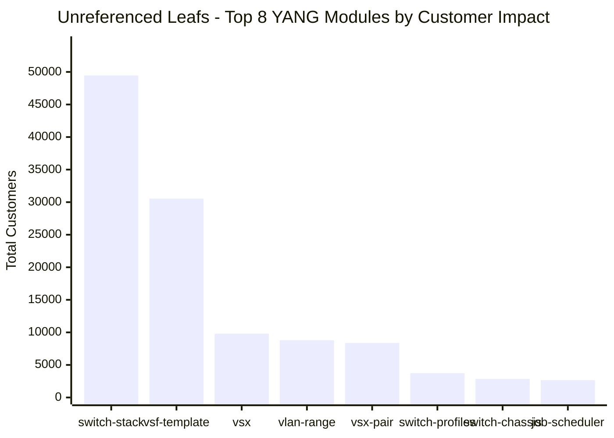
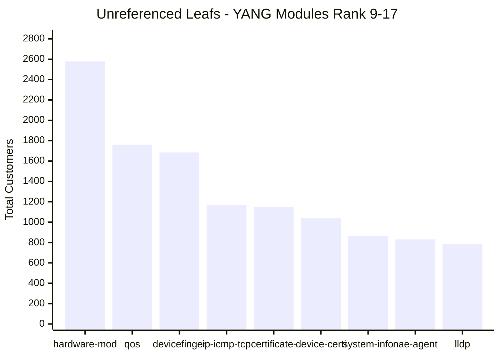
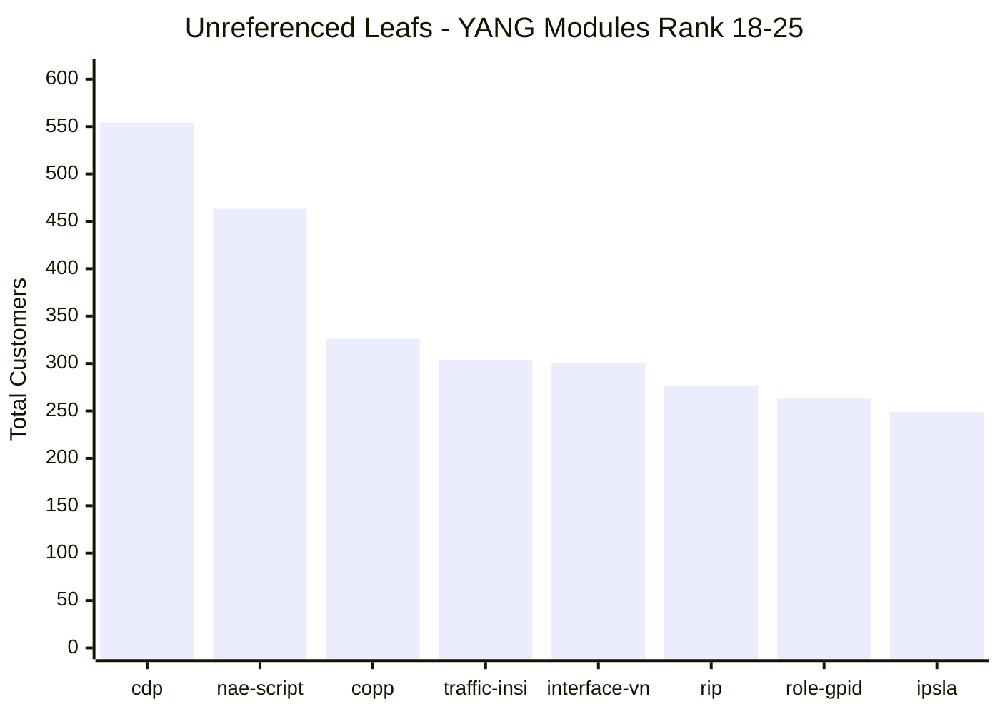

# CX Device Configuration - Unreferenced Leaf Analysis

## Summary

This report identifies leafs from the PLM Consolidated Leaf List that are **NOT** referenced by `aruba-cx-device-configuration.yang` through direct or transitive imports.

> **Note:** This analysis uses transitive dependency checking - a module is considered 'referenced' if it is imported directly OR indirectly through the import chain.

### Key Statistics

| Metric | Count |
|--------|-------|
| Total Leafs Analyzed | 2707 |
| Direct Imports by CX Device Config | 60 |
| Total Transitively Referenced Modules | 215 |
| Leafs in Referenced Modules | 2247 |
| **Leafs NOT Referenced** | **460** |
| Unique YANG Modules with Unreferenced Leafs | 52 |
| Total Big Cluster Customers Affected | 87,680 |
| Total Small Cluster Customers Affected | 45,002 |
| **Total Customers Affected** | **132,682** |

### Customer Impact by YANG Module

#### Chart 1: Highest Impact (Rank 1-8)

| # | Chart Label | Full YANG Module Name | Total Customers |
|---|-------------|----------------------|----------------|
| 1 | switch-stack | aruba-switch-stack | 49,453 |
| 2 | vsf-template | aruba-vsf-template | 30,543 |
| 3 | vsx | aruba-vsx | 9,805 |
| 4 | vlan-range | aruba-vlan-range | 8,799 |
| 5 | vsx-pair | aruba-vsx-pair | 8,372 |
| 6 | switch-profiles | aruba-switch-profiles | 3,732 |
| 7 | switch-chassis | aruba-switch-chassis | 2,846 |
| 8 | job-scheduler | aruba-job-scheduler | 2,668 |

#### Chart 2: Medium Impact (Rank 9-17)

| # | Chart Label | Full YANG Module Name | Total Customers |
|---|-------------|----------------------|----------------|
| 9 | hardware-mod | aruba-hardware-module-profile | 2,578 |
| 10 | qos | aruba-qos | 1,761 |
| 11 | devicefinger | aruba-devicefingerprinting | 1,684 |
| 12 | ip-icmp-tcp | aruba-ip-icmp-tcp | 1,168 |
| 13 | certificate- | aruba-certificate-rcp | 1,149 |
| 14 | device-certi | aruba-device-certificate | 1,038 |
| 15 | system-info | aruba-system-info | 866 |
| 16 | nae-agent | aruba-nae-agent | 831 |
| 17 | lldp | aruba-lldp | 783 |

#### Chart 3: Lower Impact (Rank 18-25)

| # | Chart Label | Full YANG Module Name | Total Customers |
|---|-------------|----------------------|----------------|
| 18 | cdp | aruba-cdp | 554 |
| 19 | nae-script | aruba-nae-script | 463 |
| 20 | copp | aruba-copp | 326 |
| 21 | traffic-insi | aruba-traffic-insight | 304 |
| 22 | interface-vn | aruba-interface-vni | 300 |
| 23 | rip | aruba-rip | 276 |
| 24 | role-gpid | aruba-role-gpid | 264 |
| 25 | ipsla | aruba-ipsla | 249 |

### Complete List: All 52 Unreferenced YANG Modules

| Rank | YANG Module | Total Customers |
|------|-------------|----------------|
| 1 | aruba-switch-stack | 49,453 |
| 2 | aruba-vsf-template | 30,543 |
| 3 | aruba-vsx | 9,805 |
| 4 | aruba-vlan-range | 8,799 |
| 5 | aruba-vsx-pair | 8,372 |
| 6 | aruba-switch-profiles | 3,732 |
| 7 | aruba-switch-chassis | 2,846 |
| 8 | aruba-job-scheduler | 2,668 |
| 9 | aruba-hardware-module-profile | 2,578 |
| 10 | aruba-qos | 1,761 |
| 11 | aruba-devicefingerprinting | 1,684 |
| 12 | aruba-ip-icmp-tcp | 1,168 |
| 13 | aruba-certificate-rcp | 1,149 |
| 14 | aruba-device-certificate | 1,038 |
| 15 | aruba-system-info | 866 |
| 16 | aruba-nae-agent | 831 |
| 17 | aruba-lldp | 783 |
| 18 | aruba-cdp | 554 |
| 19 | aruba-nae-script | 463 |
| 20 | aruba-copp | 326 |
| 21 | aruba-traffic-insight | 304 |
| 22 | aruba-interface-vni | 300 |
| 23 | aruba-rip | 276 |
| 24 | aruba-role-gpid | 264 |
| 25 | aruba-ipsla | 249 |
| 26 | aruba-interface-vxlan-tunnel | 235 |
| 27 | aruba-mirror-endpoint | 231 |
| 28 | aruba-nae-lite | 166 |
| 29 | aruba-ip-lockdown | 142 |
| 30 | aruba-firmware-management | 116 |
| 31 | aruba-erps | 105 |
| 32 | aruba-psm | 97 |
| 33 | aruba-ptp | 97 |
| 34 | aruba-static-mac | 95 |
| 35 | aruba-mvrp | 70 |
| 36 | aruba-mac-lockout | 63 |
| 37 | aruba-ufd | 62 |
| 38 | aruba-dhcp-client | 56 |
| 39 | aruba-track-object | 50 |
| 40 | aruba-smartlink | 49 |
| 41 | aruba-ip-binding | 42 |
| 42 | aruba-feature-pack | 40 |
| 43 | aruba-config-checkpoint | 31 |
| 44 | aruba-container | 22 |
| 45 | aruba-rmon-alarm | 22 |
| 46 | aruba-countermon | 18 |
| 47 | aruba-dsm | 13 |
| 48 | aruba-advanced-intelligent-forwarding | 13 |
| 49 | aruba-sysmon | 12 |
| 50 | aruba-container-network | 9 |
| 51 | aruba-ip-routing | 8 |
| 52 | aruba-multicast | 6 |

## YANG Modules Referenced by aruba-cx-device-configuration.yang

The following 215 YANG modules are directly or transitively referenced:

Click to expand full list

- `aruba-802dot11`
- `aruba-802dot11k`
- `aruba-802dot11k-bcn-rpt-req`
- `aruba-802dot11k-rrm-ie`
- `aruba-aaa-bandwidth-contract`
- `aruba-aaa-captive-portal`
- `aruba-aaa-dot1xauth`
- `aruba-aaa-dot1xsupp`
- `aruba-aaa-lma`
- `aruba-aaa-macauth`
- `aruba-aaa-profile`
- `aruba-aaa-types`
- `aruba-aaa-user-derivation-rules`
- `aruba-aaa-webauth`
- `aruba-alias`
- `aruba-ap-port-profile`
- `aruba-ap-uplink`
- `aruba-app-recog-control`
- `aruba-apptag-types`
- `aruba-aspath-list`
- `aruba-auth-server`
- `aruba-auth-server-global`
- `aruba-auth-server-group`
- `aruba-bfd`
- `aruba-bgp`
- `aruba-bgp-types`
- `aruba-br-port-profile`
- `aruba-cellular`
- `aruba-cellular-types`
- `aruba-certificate`
- `aruba-certificate-store`
- `aruba-client-insight`
- `aruba-client-iptracker`
- `aruba-client-iptracker-interface`
- `aruba-command-extensions`
- `aruba-common-types`
- `aruba-community-list`
- `aruba-cx-device-configuration`
- `aruba-dap-application`
- `aruba-dap-sla`
- `aruba-ddns`
- `aruba-ddns-http`
- `aruba-destination-guard`
- `aruba-device-configuration-common`
- `aruba-device-profile`
- `aruba-devicefingerprinting-interface`
- `aruba-devicefingerprinting-profile`
- `aruba-dhcp-pool`
- `aruba-dhcp-relay`
- `aruba-dhcp-server`
- `aruba-dhcp-snooping`
- `aruba-dhcp-snooping-interface`
- `aruba-dns`
- `aruba-dpi-error-page-url`
- `aruba-dpi-types`
- `aruba-dss-types`
- `aruba-dualip`
- `aruba-dynamic-arp-inspection-interface`
- `aruba-dynamic-assignment`
- `aruba-est`
- `aruba-evpn`
- `aruba-extensions`
- `aruba-external-storage`
- `aruba-fault-monitor`
- `aruba-first-hop-security`
- `aruba-flow-telemetry-common`
- `aruba-flow-tracking`
- `aruba-gw-port-profile`
- `aruba-gw-scheduler-profile`
- `aruba-hardware-module-common`
- `aruba-hotspot2`
- `aruba-hotspot2-anqp-3gpp`
- `aruba-hotspot2-anqp-domain-name`
- `aruba-hotspot2-anqp-ip-addr-avail`
- `aruba-hotspot2-anqp-nai-realm`
- `aruba-hotspot2-anqp-nwk-auth`
- `aruba-hotspot2-anqp-roam-cons`
- `aruba-hotspot2-anqp-venue-name`
- `aruba-hotspot2-h2qp-conn-cap`
- `aruba-hotspot2-h2qp-oper-class`
- `aruba-hotspot2-h2qp-oper-name`
- `aruba-hotspot2-h2qp-osu-provider`
- `aruba-hotspot2-h2qp-wan-metrics`
- `aruba-hotspot2-type`
- `aruba-http-proxy`
- `aruba-interface-common`
- `aruba-interface-ethernet`
- `aruba-interface-loopback`
- `aruba-interface-management`
- `aruba-interface-portchannel`
- `aruba-interface-profile`
- `aruba-interface-qos`
- `aruba-interface-subinterface`
- `aruba-interface-tunnel`
- `aruba-interface-types`
- `aruba-interface-vlan`
- `aruba-interface-vxlan`
- `aruba-ip-lockdown-interface`
- `aruba-ip-source-interface`
- `aruba-ipfix-flow-collector`
- `aruba-ipfix-flow-exporter`
- `aruba-ipfix-flow-monitor`
- `aruba-ipfix-flow-record`
- `aruba-keychain`
- `aruba-l3-route`
- `aruba-lacp`
- `aruba-local-management`
- `aruba-location-types`
- `aruba-logging`
- `aruba-logging-types`
- `aruba-loop-protect`
- `aruba-macsec`
- `aruba-management-accounting`
- `aruba-management-authentication`
- `aruba-management-authorization`
- `aruba-management-user`
- `aruba-management-user-group`
- `aruba-mbssid-group`
- `aruba-mgmd`
- `aruba-mgmd-interface`
- `aruba-mirror`
- `aruba-mirror-types`
- `aruba-mka`
- `aruba-model-types`
- `aruba-mpls-types`
- `aruba-mpsk-local`
- `aruba-msdp`
- `aruba-multicast-dns`
- `aruba-multicast-static-route`
- `aruba-named-condition`
- `aruba-named-vlan`
- `aruba-namedfilter`
- `aruba-nd-snooping`
- `aruba-nd-snooping-interface`
- `aruba-net-dfp`
- `aruba-net-group`
- `aruba-net-service`
- `aruba-nexthop-group`
- `aruba-ntp`
- `aruba-ntp-types`
- `aruba-object-group`
- `aruba-ospfv2`
- `aruba-ospfv3`
- `aruba-passpoint`
- `aruba-passpoint-identity`
- `aruba-passpoint-type`
- `aruba-pbt`
- `aruba-persona-types`
- `aruba-personal`
- `aruba-pim`
- `aruba-pim-interface`
- `aruba-platform-types`
- `aruba-policy`
- `aruba-policy-condition`
- `aruba-policy-types`
- `aruba-port-security`
- `aruba-portfilter`
- `aruba-prefix-list`
- `aruba-protocol-types`
- `aruba-ptp-interface`
- `aruba-ptp-types`
- `aruba-qos-cos`
- `aruba-qos-device-priority`
- `aruba-qos-dscp`
- `aruba-qos-global`
- `aruba-qos-pool`
- `aruba-qos-protocol`
- `aruba-qos-queue`
- `aruba-qos-schedule`
- `aruba-qos-threshold-profile`
- `aruba-qos-tos`
- `aruba-qos-types`
- `aruba-radio`
- `aruba-radio-types`
- `aruba-radius-modifiers`
- `aruba-remote-management`
- `aruba-role`
- `aruba-routemap`
- `aruba-router-discovery`
- `aruba-routing-types`
- `aruba-security-types`
- `aruba-sflow`
- `aruba-snmp`
- `aruba-snmp-trap`
- `aruba-ssh-server`
- `aruba-ssid-types`
- `aruba-static-route`
- `aruba-stp`
- `aruba-sw-port-profile`
- `aruba-switch-certificate-usage`
- `aruba-switch-model-port-types`
- `aruba-switch-system`
- `aruba-timerange`
- `aruba-ubt`
- `aruba-ucc`
- `aruba-udp-broadcast-forwarder`
- `aruba-uplink`
- `aruba-vlan`
- `aruba-vlan-common`
- `aruba-vlan-types`
- `aruba-vrf`
- `aruba-vrrp`
- `aruba-vrrp-interface`
- `aruba-webcc-types`
- `aruba-webserver`
- `aruba-wlan`
- `aruba-wlan-security`
- `aruba-wlan-security-types`
- `ietf-inet-types`
- `ietf-routing-types`
- `ietf-yang-types`
- `openconfig-extensions`
- `openconfig-inet-types`
- `openconfig-types`
- `openconfig-yang-types`

## Unreferenced Leafs by YANG Module

The following shows leafs grouped by their YANG module that are NOT referenced:

### aruba-switch-stack

- **Leaf Count:** 11
- **Big Cluster Customers:** 32,535
- **Small Cluster Customers:** 16,918
- **Total Customers Affected:** 49,453

| Leaf Name | Big Cluster Count | Small Cluster Count | Total |
|-----------|-------------------|---------------------|-------|
| `aruba-switch-stack:stacks.stack.name` | 5,701 | 3,022 | 8,723 |
| `aruba-switch-stack:stacks.stack.members.id` | 5,675 | 3,022 | 8,697 |
| `aruba-switch-stack:stacks.stack.members.sku` | 5,671 | 3,022 | 8,693 |
| `aruba-switch-stack:stacks.stack.platform` | 5,671 | 3,022 | 8,693 |
| `aruba-switch-stack:stacks.stack.members.links.link1.interfaces` | 3,227 | 1,643 | 4,870 |
| `aruba-switch-stack:stacks.stack.members.links.link2.interfaces` | 3,006 | 1,505 | 4,511 |
| `aruba-switch-stack:stacks.stack.secondary-member` | 2,641 | 1,374 | 4,015 |
| `aruba-switch-stack:stacks.stack.split-detection-method` | 826 | 291 | 1,117 |
| `aruba-switch-stack:stacks.stack.members.hw-profile` | 88 | 0 | 88 |
| `aruba-switch-stack:stacks.stack.members.links.link1.description` | 18 | 11 | 29 |
| `aruba-switch-stack:stacks.stack.members.links.link2.description` | 11 | 6 | 17 |

### aruba-vsf-template

- **Leaf Count:** 5
- **Big Cluster Customers:** 20,027
- **Small Cluster Customers:** 10,516
- **Total Customers Affected:** 30,543

| Leaf Name | Big Cluster Count | Small Cluster Count | Total |
|-----------|-------------------|---------------------|-------|
| `aruba-vsf-template:vsf-templates.template.name` | 5,558 | 2,963 | 8,521 |
| `aruba-vsf-template:vsf-templates.template.members.id` | 5,501 | 2,944 | 8,445 |
| `aruba-vsf-template:vsf-templates.template.members.sku` | 5,501 | 2,944 | 8,445 |
| `aruba-vsf-template:vsf-templates.template.secondary-member` | 2,641 | 1,374 | 4,015 |
| `aruba-vsf-template:vsf-templates.template.split-detection-method` | 826 | 291 | 1,117 |

### aruba-vsx

- **Leaf Count:** 17
- **Big Cluster Customers:** 6,064
- **Small Cluster Customers:** 3,741
- **Total Customers Affected:** 9,805

| Leaf Name | Big Cluster Count | Small Cluster Count | Total |
|-----------|-------------------|---------------------|-------|
| `aruba-vsx:vsx-profiles.vsx.name` | 847 | 505 | 1,352 |
| `aruba-vsx:vsx-profiles.vsx.peer1.role` | 774 | 492 | 1,266 |
| `aruba-vsx:vsx-profiles.vsx.peer2.role` | 774 | 492 | 1,266 |
| `aruba-vsx:vsx-profiles.vsx.sync-features.system-mac` | 704 | 425 | 1,129 |
| `aruba-vsx:vsx-profiles.vsx.peer1.keepalive-device.peer-ip` | 680 | 422 | 1,102 |
| `aruba-vsx:vsx-profiles.vsx.peer1.keepalive-device.source-ip` | 680 | 422 | 1,102 |
| `aruba-vsx:vsx-profiles.vsx.peer2.keepalive-device.peer-ip` | 680 | 422 | 1,102 |
| `aruba-vsx:vsx-profiles.vsx.peer2.keepalive-device.source-ip` | 680 | 422 | 1,102 |
| `aruba-vsx:vsx-profiles.vsx.sync-features.linkup-delay-timer` | 138 | 102 | 240 |
| `aruba-vsx:vsx-profiles.vsx.sync-features.inter-switch-link-timers.hold-time` | 24 | 7 | 31 |
| `aruba-vsx:vsx-profiles.vsx.sync-features.inter-switch-link-timers.hello-interval` | 21 | 7 | 28 |
| `aruba-vsx:vsx-profiles.vsx.sync-features.inter-switch-link-timers.dead-interval` | 18 | 9 | 27 |
| `aruba-vsx:vsx-profiles.vsx.sync-features.inter-switch-link-timers.peer-detect-interval` | 17 | 4 | 21 |
| `aruba-vsx:vsx-profiles.vsx.sync-features.split-recovery-disable` | 16 | 4 | 20 |
| `aruba-vsx:vsx-profiles.vsx.sync-features.keepalive.dead-interval` | 4 | 4 | 8 |
| `aruba-vsx:vsx-profiles.vsx.sync-features.keepalive.hello-interval` | 3 | 2 | 5 |
| `aruba-vsx:vsx-profiles.vsx.sync-features.keepalive.udp-port` | 4 | 0 | 4 |

### aruba-vlan-range

- **Leaf Count:** 21
- **Big Cluster Customers:** 6,676
- **Small Cluster Customers:** 2,123
- **Total Customers Affected:** 8,799

| Leaf Name | Big Cluster Count | Small Cluster Count | Total |
|-----------|-------------------|---------------------|-------|
| `aruba-vlan-range:layer2-vlan-range.client-ip-tracker-enable` | 2,168 | 1,190 | 3,358 |
| `aruba-vlan-range:layer2-vlan-range.enable` | 2,000 | 76 | 2,076 |
| `aruba-vlan-range:layer2-vlan-range.igmp.snooping` | 958 | 347 | 1,305 |
| `aruba-vlan-range:layer2-vlan-range.dhcpv4-snooping.enable` | 781 | 294 | 1,075 |
| `aruba-vlan-range:layer2-vlan-range.igmp.version` | 281 | 120 | 401 |
| `aruba-vlan-range:layer2-vlan-range.voice-enable` | 301 | 0 | 301 |
| `aruba-vlan-range:layer2-vlan-range.dhcpv6-snooping.enable` | 85 | 39 | 124 |
| `aruba-vlan-range:layer2-vlan-range.policy-in` | 29 | 24 | 53 |
| `aruba-vlan-range:layer2-vlan-range.mld.snooping` | 18 | 9 | 27 |
| `aruba-vlan-range:layer2-vlan-range.igmp.static-group` | 17 | 4 | 21 |
| `aruba-vlan-range:layer2-vlan-range.policy-out` | 8 | 3 | 11 |
| `aruba-vlan-range:layer2-vlan-range.igmp.preprogram-starg-flow` | 5 | 5 | 10 |
| `aruba-vlan-range:layer2-vlan-range.igmp.policy-in` | 6 | 1 | 7 |
| `aruba-vlan-range:layer2-vlan-range.nd-snooping.nd-guard` | 4 | 2 | 6 |
| `aruba-vlan-range:layer2-vlan-range.nd-snooping.ra-drop` | 4 | 1 | 5 |
| `aruba-vlan-range:layer2-vlan-range.nd-snooping.ra-guard-log` | 3 | 2 | 5 |
| `aruba-vlan-range:layer2-vlan-range.dhcpv4-snooping.ip-binding-enable` | 4 | 0 | 4 |
| `aruba-vlan-range:layer2-vlan-range.nd-snooping.allow-bindings-on-trusted-ports` | 0 | 4 | 4 |
| `aruba-vlan-range:layer2-vlan-range.dynamic-arp-inspection.enable` | 2 | 1 | 3 |
| `aruba-vlan-range:layer2-vlan-range.destination-guard.enable` | 2 | 0 | 2 |
| `aruba-vlan-range:layer2-vlan-range.dhcpv6-snooping.allow-bindings-on-trusted-ports` | 0 | 1 | 1 |

### aruba-vsx-pair

- **Leaf Count:** 18
- **Big Cluster Customers:** 5,237
- **Small Cluster Customers:** 3,135
- **Total Customers Affected:** 8,372

| Leaf Name | Big Cluster Count | Small Cluster Count | Total |
|-----------|-------------------|---------------------|-------|
| `aruba-vsx-pair:vsx-config.vsx.name` | 866 | 513 | 1,379 |
| `aruba-vsx-pair:vsx-config.vsx.inter-switch-link.interface-lag` | 854 | 511 | 1,365 |
| `aruba-vsx-pair:vsx-config.vsx.role` | 774 | 492 | 1,266 |
| `aruba-vsx-pair:vsx-config.vsx.system-mac` | 704 | 425 | 1,129 |
| `aruba-vsx-pair:vsx-config.vsx.keepalive.peer-ip` | 594 | 350 | 944 |
| `aruba-vsx-pair:vsx-config.vsx.keepalive.source-ip` | 594 | 350 | 944 |
| `aruba-vsx-pair:vsx-config.vsx.keepalive.vrf-ref` | 594 | 350 | 944 |
| `aruba-vsx-pair:vsx-config.vsx.linkup-delay-timer` | 138 | 102 | 240 |
| `aruba-vsx-pair:vsx-config.vsx.inter-switch-link.hold-time` | 24 | 7 | 31 |
| `aruba-vsx-pair:vsx-config.vsx.inter-switch-link.hello-interval` | 21 | 7 | 28 |
| `aruba-vsx-pair:vsx-config.vsx.inter-switch-link.dead-interval` | 18 | 9 | 27 |
| `aruba-vsx-pair:vsx-config.vsx.inter-switch-link.peer-detect-interval` | 17 | 4 | 21 |
| `aruba-vsx-pair:vsx-config.vsx.split-recovery-disable` | 16 | 4 | 20 |
| `aruba-vsx-pair:vsx-config.vsx.inter-switch-link.interface-eth` | 10 | 4 | 14 |
| `aruba-vsx-pair:vsx-config.vsx.keepalive.dead-interval` | 4 | 4 | 8 |
| `aruba-vsx-pair:vsx-config.vsx.keepalive.hello-interval` | 3 | 2 | 5 |
| `aruba-vsx-pair:vsx-config.vsx.keepalive.udp-port` | 4 | 0 | 4 |
| `aruba-vsx-pair:vsx-config.vsx.linkup-delay-timer-exclude` | 2 | 1 | 3 |

### aruba-switch-profiles

- **Leaf Count:** 2
- **Big Cluster Customers:** 2,322
- **Small Cluster Customers:** 1,410
- **Total Customers Affected:** 3,732

| Leaf Name | Big Cluster Count | Small Cluster Count | Total |
|-----------|-------------------|---------------------|-------|
| `aruba-switch-profiles:switch-profiles.profile.name` | 1,161 | 705 | 1,866 |
| `aruba-switch-profiles:switch-profiles.profile.selected` | 1,161 | 705 | 1,866 |

### aruba-switch-chassis

- **Leaf Count:** 7
- **Big Cluster Customers:** 2,224
- **Small Cluster Customers:** 622
- **Total Customers Affected:** 2,846

| Leaf Name | Big Cluster Count | Small Cluster Count | Total |
|-----------|-------------------|---------------------|-------|
| `aruba-switch-chassis:switch-chassis.chassis.chassis-name` | 793 | 156 | 949 |
| `aruba-switch-chassis:switch-chassis.chassis.line-modules.line-module-name` | 793 | 156 | 949 |
| `aruba-switch-chassis:switch-chassis.chassis.line-modules.sku` | 313 | 155 | 468 |
| `aruba-switch-chassis:switch-chassis.chassis.platform` | 313 | 155 | 468 |
| `aruba-switch-chassis:switch-chassis.chassis.line-modules.hw-profile` | 7 | 0 | 7 |
| `aruba-switch-chassis:switch-chassis.chassis.line-modules.power-admin-state` | 4 | 0 | 4 |
| `aruba-switch-chassis:switch-chassis.chassis.line-modules.power-priority` | 1 | 0 | 1 |

### aruba-job-scheduler

- **Leaf Count:** 31
- **Big Cluster Customers:** 1,700
- **Small Cluster Customers:** 968
- **Total Customers Affected:** 2,668

| Leaf Name | Big Cluster Count | Small Cluster Count | Total |
|-----------|-------------------|---------------------|-------|
| `aruba-job-scheduler:job-scheduler.schedule.name` | 194 | 85 | 279 |
| `aruba-job-scheduler:job-scheduler.schedule.job.job-name` | 176 | 82 | 258 |
| `aruba-job-scheduler:job-scheduler.schedule.job.entry.sequence-number` | 136 | 75 | 211 |
| `aruba-job-scheduler:job-scheduler.schedule.job.entry.cli-command` | 135 | 75 | 210 |
| `aruba-job-scheduler:job-scheduler.schedule.job.entry.type` | 135 | 75 | 210 |
| `aruba-job-scheduler:job-scheduler.schedule.trigger-type` | 117 | 68 | 185 |
| `aruba-job-scheduler:job-scheduler.schedule.schedule-entry.schedule-job` | 113 | 67 | 180 |
| `aruba-job-scheduler:job-scheduler.schedule.schedule-entry.sequence-number` | 113 | 67 | 180 |
| `aruba-job-scheduler:job-scheduler.schedule.start-date-at` | 82 | 23 | 105 |
| `aruba-job-scheduler:job-scheduler.schedule.start-time-at` | 82 | 23 | 105 |
| `aruba-job-scheduler:job-scheduler.schedule.trigger-at` | 82 | 23 | 105 |
| `aruba-job-scheduler:job-scheduler.schedule.job.description` | 53 | 34 | 87 |
| `aruba-job-scheduler:job-scheduler.schedule.frequency` | 31 | 36 | 67 |
| `aruba-job-scheduler:job-scheduler.schedule.start-time-on` | 31 | 36 | 67 |
| `aruba-job-scheduler:job-scheduler.schedule.trigger-on` | 31 | 36 | 67 |
| `aruba-job-scheduler:job-scheduler.schedule.description` | 41 | 26 | 67 |
| `aruba-job-scheduler:job-scheduler.schedule.start-date-on` | 29 | 33 | 62 |
| `aruba-job-scheduler:job-scheduler.schedule.trigger-on-weekly` | 16 | 14 | 30 |
| `aruba-job-scheduler:job-scheduler.schedule.week-day` | 16 | 14 | 30 |
| `aruba-job-scheduler:job-scheduler.schedule.trigger-every` | 12 | 13 | 25 |
| `aruba-job-scheduler:job-scheduler.schedule.start-time-every` | 12 | 12 | 24 |
| `aruba-job-scheduler:job-scheduler.schedule.start-date-every` | 11 | 10 | 21 |
| `aruba-job-scheduler:job-scheduler.schedule.job.entry.cli-delay` | 13 | 5 | 18 |
| `aruba-job-scheduler:job-scheduler.schedule.count` | 8 | 10 | 18 |
| `aruba-job-scheduler:job-scheduler.schedule.days` | 4 | 10 | 14 |
| `aruba-job-scheduler:job-scheduler.schedule.enable` | 13 | 0 | 13 |
| `aruba-job-scheduler:job-scheduler.schedule.minutes` | 7 | 3 | 10 |
| `aruba-job-scheduler:job-scheduler.schedule.trigger-on-monthly` | 2 | 6 | 8 |
| `aruba-job-scheduler:job-scheduler.schedule.month-day` | 2 | 5 | 7 |
| `aruba-job-scheduler:job-scheduler.schedule.job.enable` | 2 | 1 | 3 |
| `aruba-job-scheduler:job-scheduler.schedule.hours` | 1 | 1 | 2 |

### aruba-hardware-module-profile

- **Leaf Count:** 6
- **Big Cluster Customers:** 1,531
- **Small Cluster Customers:** 1,047
- **Total Customers Affected:** 2,578

| Leaf Name | Big Cluster Count | Small Cluster Count | Total |
|-----------|-------------------|---------------------|-------|
| `aruba-hardware-module-profile:hardware-modules.hw-profile.name` | 523 | 321 | 844 |
| `aruba-hardware-module-profile:hardware-modules.hw-profile.interface-group-speed-profile.group-id` | 470 | 305 | 775 |
| `aruba-hardware-module-profile:hardware-modules.hw-profile.interface-group-speed-profile.speed` | 468 | 305 | 773 |
| `aruba-hardware-module-profile:hardware-modules.hw-profile.member-or-slot-ids` | 0 | 94 | 94 |
| `aruba-hardware-module-profile:hardware-modules.hw-profile.always-on-poe` | 44 | 17 | 61 |
| `aruba-hardware-module-profile:hardware-modules.hw-profile.quick-poe` | 26 | 5 | 31 |

### aruba-qos

- **Leaf Count:** 3
- **Big Cluster Customers:** 1,761
- **Small Cluster Customers:** 0
- **Total Customers Affected:** 1,761

| Leaf Name | Big Cluster Count | Small Cluster Count | Total |
|-----------|-------------------|---------------------|-------|
| `aruba-qos:global-qos.trust` | 1,327 | 0 | 1,327 |
| `aruba-qos:global-qos.q-profile` | 217 | 0 | 217 |
| `aruba-qos:global-qos.sched-profile` | 217 | 0 | 217 |

### aruba-devicefingerprinting

- **Leaf Count:** 2
- **Big Cluster Customers:** 724
- **Small Cluster Customers:** 960
- **Total Customers Affected:** 1,684

| Leaf Name | Big Cluster Count | Small Cluster Count | Total |
|-----------|-------------------|---------------------|-------|
| `aruba-devicefingerprinting:devicefingerprinting.profile.name` | 362 | 480 | 842 |
| `aruba-devicefingerprinting:devicefingerprinting.profile.profile-name` | 362 | 480 | 842 |

### aruba-ip-icmp-tcp

- **Leaf Count:** 4
- **Big Cluster Customers:** 1,168
- **Small Cluster Customers:** 0
- **Total Customers Affected:** 1,168

| Leaf Name | Big Cluster Count | Small Cluster Count | Total |
|-----------|-------------------|---------------------|-------|
| `aruba-ip-icmp-tcp:ip-icmp-tcp.profile.name` | 555 | 0 | 555 |
| `aruba-ip-icmp-tcp:ip-icmp-tcp.profile.ip-icmp.redirect` | 530 | 0 | 530 |
| `aruba-ip-icmp-tcp:ip-icmp-tcp.profile.ip-icmp.unreachable` | 82 | 0 | 82 |
| `aruba-ip-icmp-tcp:ip-icmp-tcp.profile.ip-icmp.throttle` | 1 | 0 | 1 |

### aruba-certificate-rcp

- **Leaf Count:** 7
- **Big Cluster Customers:** 869
- **Small Cluster Customers:** 280
- **Total Customers Affected:** 1,149

| Leaf Name | Big Cluster Count | Small Cluster Count | Total |
|-----------|-------------------|---------------------|-------|
| `aruba-certificate-rcp:certificate-rcp.ta-profile.name` | 833 | 256 | 1,089 |
| `aruba-certificate-rcp:certificate-rcp.ta-profile.ocsp.vrf` | 23 | 10 | 33 |
| `aruba-certificate-rcp:certificate-rcp.ta-profile.ocsp.enforcement-level` | 11 | 5 | 16 |
| `aruba-certificate-rcp:certificate-rcp.ta-profile.rcp-primary-method` | 0 | 5 | 5 |
| `aruba-certificate-rcp:certificate-rcp.ta-profile.ocsp.disable-nonce` | 2 | 1 | 3 |
| `aruba-certificate-rcp:certificate-rcp.ta-profile.ocsp.primary-url` | 0 | 2 | 2 |
| `aruba-certificate-rcp:certificate-rcp.ta-profile.ocsp.secondary-url` | 0 | 1 | 1 |

### aruba-device-certificate

- **Leaf Count:** 16
- **Big Cluster Customers:** 682
- **Small Cluster Customers:** 356
- **Total Customers Affected:** 1,038

| Leaf Name | Big Cluster Count | Small Cluster Count | Total |
|-----------|-------------------|---------------------|-------|
| `aruba-device-certificate:device-certificates.device-certificate.name` | 235 | 114 | 349 |
| `aruba-device-certificate:device-certificates.device-certificate.app-usage` | 208 | 101 | 309 |
| `aruba-device-certificate:device-certificates.device-certificate.subject.common-name` | 66 | 27 | 93 |
| `aruba-device-certificate:device-certificates.device-certificate.subject.org` | 32 | 19 | 51 |
| `aruba-device-certificate:device-certificates.device-certificate.subject.state` | 27 | 19 | 46 |
| `aruba-device-certificate:device-certificates.device-certificate.subject.org-unit` | 28 | 18 | 46 |
| `aruba-device-certificate:device-certificates.device-certificate.subject.locality` | 29 | 16 | 45 |
| `aruba-device-certificate:device-certificates.device-certificate.cert-key-type` | 12 | 11 | 23 |
| `aruba-device-certificate:device-certificates.device-certificate.rsa-key-length` | 7 | 11 | 18 |
| `aruba-device-certificate:device-certificates.device-certificate.est-profile` | 8 | 6 | 14 |
| `aruba-device-certificate:device-certificates.device-certificate.subject.country` | 10 | 3 | 13 |
| `aruba-device-certificate:device-certificates.device-certificate.ext-key-usage` | 5 | 4 | 9 |
| `aruba-device-certificate:device-certificates.device-certificate.key-usage` | 5 | 4 | 9 |
| `aruba-device-certificate:device-certificates.device-certificate.ecdsa-curve-size` | 5 | 0 | 5 |
| `aruba-device-certificate:device-certificates.device-certificate.subject-alt-name-dns` | 3 | 2 | 5 |
| `aruba-device-certificate:device-certificates.device-certificate.subject-alt-name-ip` | 2 | 1 | 3 |

### aruba-system-info

- **Leaf Count:** 2
- **Big Cluster Customers:** 615
- **Small Cluster Customers:** 251
- **Total Customers Affected:** 866

| Leaf Name | Big Cluster Count | Small Cluster Count | Total |
|-----------|-------------------|---------------------|-------|
| `aruba-system-info:system-info.sys-description` | 575 | 229 | 804 |
| `aruba-system-info:system-info.snmpv3-local-engine-id` | 40 | 22 | 62 |

### aruba-nae-agent

- **Leaf Count:** 5
- **Big Cluster Customers:** 487
- **Small Cluster Customers:** 344
- **Total Customers Affected:** 831

| Leaf Name | Big Cluster Count | Small Cluster Count | Total |
|-----------|-------------------|---------------------|-------|
| `aruba-nae-agent:nae-agents.nae-agent.agent-disable` | 119 | 88 | 207 |
| `aruba-nae-agent:nae-agents.nae-agent.agent-name` | 119 | 88 | 207 |
| `aruba-nae-agent:nae-agents.nae-agent.script-name` | 119 | 88 | 207 |
| `aruba-nae-agent:nae-agents.nae-agent.agent-parameters.name` | 65 | 40 | 105 |
| `aruba-nae-agent:nae-agents.nae-agent.agent-parameters.value` | 65 | 40 | 105 |

### aruba-lldp

- **Leaf Count:** 25
- **Big Cluster Customers:** 535
- **Small Cluster Customers:** 248
- **Total Customers Affected:** 783

| Leaf Name | Big Cluster Count | Small Cluster Count | Total |
|-----------|-------------------|---------------------|-------|
| `aruba-lldp:lldp.profile.name` | 236 | 109 | 345 |
| `aruba-lldp:lldp.profile.disable` | 70 | 25 | 95 |
| `aruba-lldp:lldp.profile.management-ip-address` | 51 | 28 | 79 |
| `aruba-lldp:lldp.profile.lldp-trap-enable` | 38 | 26 | 64 |
| `aruba-lldp:lldp.profile.tlv.basic.port-descr` | 29 | 11 | 40 |
| `aruba-lldp:lldp.profile.transmit-interval` | 15 | 7 | 22 |
| `aruba-lldp:lldp.profile.reinit-delay` | 17 | 4 | 21 |
| `aruba-lldp:lldp.profile.dcbx-enable` | 11 | 9 | 20 |
| `aruba-lldp:lldp.profile.tlv.basic.management-addr` | 11 | 1 | 12 |
| `aruba-lldp:lldp.profile.tlv.basic.system-descr` | 11 | 1 | 12 |
| `aruba-lldp:lldp.profile.management-vlan` | 5 | 6 | 11 |
| `aruba-lldp:lldp.profile.tlv.dot1.port-vlan-id` | 6 | 1 | 7 |
| `aruba-lldp:lldp.profile.hold-multiplier` | 5 | 2 | 7 |
| `aruba-lldp:lldp.profile.tlv.dot1.port-vlan-name` | 5 | 1 | 6 |
| `aruba-lldp:lldp.profile.tlv-dcbx-app.app-tlv.port-number` | 3 | 2 | 5 |
| `aruba-lldp:lldp.profile.tlv-dcbx-app.app-tlv.priority` | 3 | 2 | 5 |
| `aruba-lldp:lldp.profile.tlv-dcbx-app.app-tlv.protocol` | 3 | 2 | 5 |
| `aruba-lldp:lldp.profile.tlv-dcbx-app.app-tlv.protocol-port-number` | 3 | 2 | 5 |
| `aruba-lldp:lldp.profile.dcbx-version` | 2 | 3 | 5 |
| `aruba-lldp:lldp.profile.tlv.basic.system-cap` | 3 | 1 | 4 |
| `aruba-lldp:lldp.profile.tlv.oui` | 2 | 1 | 3 |
| `aruba-lldp:lldp.profile.tlv.dot1.link-aggregation` | 2 | 1 | 3 |
| `aruba-lldp:lldp.profile.tlv.basic.system-name` | 2 | 1 | 3 |
| `aruba-lldp:lldp.profile.neighbor-last-update-enable` | 1 | 2 | 3 |
| `aruba-lldp:lldp.profile.transmit-delay` | 1 | 0 | 1 |

### aruba-cdp

- **Leaf Count:** 2
- **Big Cluster Customers:** 364
- **Small Cluster Customers:** 190
- **Total Customers Affected:** 554

| Leaf Name | Big Cluster Count | Small Cluster Count | Total |
|-----------|-------------------|---------------------|-------|
| `aruba-cdp:cdp.profile.enable` | 182 | 95 | 277 |
| `aruba-cdp:cdp.profile.name` | 182 | 95 | 277 |

### aruba-nae-script

- **Leaf Count:** 2
- **Big Cluster Customers:** 269
- **Small Cluster Customers:** 194
- **Total Customers Affected:** 463

| Leaf Name | Big Cluster Count | Small Cluster Count | Total |
|-----------|-------------------|---------------------|-------|
| `aruba-nae-script:nae-scripts.nae-script.name` | 135 | 97 | 232 |
| `aruba-nae-script:nae-scripts.nae-script.script` | 134 | 97 | 231 |

### aruba-copp

- **Leaf Count:** 4
- **Big Cluster Customers:** 208
- **Small Cluster Customers:** 118
- **Total Customers Affected:** 326

| Leaf Name | Big Cluster Count | Small Cluster Count | Total |
|-----------|-------------------|---------------------|-------|
| `aruba-copp:copp.profile.name` | 60 | 34 | 94 |
| `aruba-copp:copp.profile.copp-policy.configured-copp-policy-entries.class` | 55 | 32 | 87 |
| `aruba-copp:copp.profile.copp-policy.configured-copp-policy-entries.priority` | 55 | 32 | 87 |
| `aruba-copp:copp.profile.copp-policy.applied` | 38 | 20 | 58 |

### aruba-traffic-insight

- **Leaf Count:** 11
- **Big Cluster Customers:** 154
- **Small Cluster Customers:** 150
- **Total Customers Affected:** 304

| Leaf Name | Big Cluster Count | Small Cluster Count | Total |
|-----------|-------------------|---------------------|-------|
| `aruba-traffic-insight:traffic-insight.instance.name` | 25 | 23 | 48 |
| `aruba-traffic-insight:traffic-insight.instance.enable` | 24 | 23 | 47 |
| `aruba-traffic-insight:traffic-insight.instance.monitor.monitor-name` | 23 | 23 | 46 |
| `aruba-traffic-insight:traffic-insight.instance.monitor.monitor-name-type` | 23 | 23 | 46 |
| `aruba-traffic-insight:traffic-insight.instance.monitor.type` | 23 | 23 | 46 |
| `aruba-traffic-insight:traffic-insight.instance.source` | 24 | 22 | 46 |
| `aruba-traffic-insight:traffic-insight.instance.monitor.monitor-n-flows` | 6 | 6 | 12 |
| `aruba-traffic-insight:traffic-insight.instance.monitor.group-by` | 4 | 5 | 9 |
| `aruba-traffic-insight:traffic-insight.instance.monitor.single-value-filter.parameter` | 1 | 1 | 2 |
| `aruba-traffic-insight:traffic-insight.instance.monitor.single-value-filter.application-id` | 1 | 0 | 1 |
| `aruba-traffic-insight:traffic-insight.instance.monitor.single-value-filter.source-port` | 0 | 1 | 1 |

### aruba-interface-vni

- **Leaf Count:** 7
- **Big Cluster Customers:** 0
- **Small Cluster Customers:** 300
- **Total Customers Affected:** 300

| Leaf Name | Big Cluster Count | Small Cluster Count | Total |
|-----------|-------------------|---------------------|-------|
| `aruba-interface-vni:vxlan-vni.profile.name` | 0 | 51 | 51 |
| `aruba-interface-vni:vxlan-vni.profile.vni.id` | 0 | 51 | 51 |
| `aruba-interface-vni:vxlan-vni.profile.vni.vni-name` | 0 | 51 | 51 |
| `aruba-interface-vni:vxlan-vni.profile.vxlan-tunnel-profile` | 0 | 51 | 51 |
| `aruba-interface-vni:vxlan-vni.profile.vni.vlan` | 0 | 48 | 48 |
| `aruba-interface-vni:vxlan-vni.profile.vni.symmetric-routing` | 0 | 24 | 24 |
| `aruba-interface-vni:vxlan-vni.profile.vni.vrf` | 0 | 24 | 24 |

### aruba-rip

- **Leaf Count:** 43
- **Big Cluster Customers:** 143
- **Small Cluster Customers:** 133
- **Total Customers Affected:** 276

| Leaf Name | Big Cluster Count | Small Cluster Count | Total |
|-----------|-------------------|---------------------|-------|
| `aruba-rip:rip.router.instance-tag` | 17 | 0 | 17 |
| `aruba-rip:rip.router.instance-tag-vrf-proto-type` | 17 | 0 | 17 |
| `aruba-rip:rip.router.proto-type` | 17 | 0 | 17 |
| `aruba-rip:rip.router.vrf` | 17 | 0 | 17 |
| `aruba-rip:rip.router.redistribute.redistribute-id` | 11 | 0 | 11 |
| `aruba-rip:rip.router.redistribute.redistribute-type` | 11 | 0 | 11 |
| `aruba-rip:rip.profile.name` | 0 | 11 | 11 |
| `aruba-rip:rip.profile.router.instance-tag` | 0 | 11 | 11 |
| `aruba-rip:rip.profile.router.instance-tag-vrf-proto-type` | 0 | 11 | 11 |
| `aruba-rip:rip.profile.router.proto-type` | 0 | 11 | 11 |
| `aruba-rip:rip.profile.router.vrf` | 0 | 11 | 11 |
| `aruba-rip:rip.router.svi-interfaces.address-family` | 9 | 0 | 9 |
| `aruba-rip:rip.router.svi-interfaces.ip-address` | 9 | 0 | 9 |
| `aruba-rip:rip.router.svi-interfaces.svi-id` | 9 | 0 | 9 |
| `aruba-rip:rip.router.svi-interfaces.svi-id-address-family` | 9 | 0 | 9 |
| `aruba-rip:rip.profile.router.redistribute.redistribute-id` | 0 | 8 | 8 |
| `aruba-rip:rip.profile.router.redistribute.redistribute-type` | 0 | 8 | 8 |
| `aruba-rip:rip.profile.description` | 0 | 8 | 8 |
| `aruba-rip:rip.profile.router.svi-interfaces.address-family` | 0 | 8 | 8 |
| `aruba-rip:rip.profile.router.svi-interfaces.ip-address` | 0 | 8 | 8 |
| `aruba-rip:rip.profile.router.svi-interfaces.svi-id` | 0 | 8 | 8 |
| `aruba-rip:rip.profile.router.svi-interfaces.svi-id-address-family` | 0 | 8 | 8 |
| `aruba-rip:rip.router.ether-interfaces.address-family` | 3 | 0 | 3 |
| `aruba-rip:rip.router.ether-interfaces.interface-name` | 3 | 0 | 3 |
| `aruba-rip:rip.router.ether-interfaces.interface-name-address-family` | 3 | 0 | 3 |
| `aruba-rip:rip.router.ether-interfaces.ip-address` | 3 | 0 | 3 |
| `aruba-rip:rip.profile.router.timers.garbage-collection` | 0 | 2 | 2 |
| `aruba-rip:rip.profile.router.timers.timeout` | 0 | 2 | 2 |
| `aruba-rip:rip.profile.router.timers.update` | 0 | 2 | 2 |
| `aruba-rip:rip.router.enable` | 2 | 0 | 2 |
| `aruba-rip:rip.profile.router.redistribute.ospf-id` | 0 | 2 | 2 |
| `aruba-rip:rip.router.redistribute.ospf-id` | 2 | 0 | 2 |
| `aruba-rip:rip.profile.router.loopback-interfaces.address-family` | 0 | 2 | 2 |
| `aruba-rip:rip.profile.router.loopback-interfaces.ip-address` | 0 | 2 | 2 |
| `aruba-rip:rip.profile.router.loopback-interfaces.loopback-id` | 0 | 2 | 2 |
| `aruba-rip:rip.profile.router.loopback-interfaces.loopback-id-address-family` | 0 | 2 | 2 |
| `aruba-rip:rip.profile.router.maximum-paths` | 0 | 1 | 1 |
| `aruba-rip:rip.profile.router.distance` | 0 | 1 | 1 |
| `aruba-rip:rip.profile.router.ether-interfaces.address-family` | 0 | 1 | 1 |
| `aruba-rip:rip.profile.router.ether-interfaces.interface-name` | 0 | 1 | 1 |
| `aruba-rip:rip.profile.router.ether-interfaces.interface-name-address-family` | 0 | 1 | 1 |
| `aruba-rip:rip.profile.router.ether-interfaces.ip-address` | 0 | 1 | 1 |
| `aruba-rip:rip.router.distance` | 1 | 0 | 1 |

### aruba-role-gpid

- **Leaf Count:** 2
- **Big Cluster Customers:** 196
- **Small Cluster Customers:** 68
- **Total Customers Affected:** 264

| Leaf Name | Big Cluster Count | Small Cluster Count | Total |
|-----------|-------------------|---------------------|-------|
| `aruba-role-gpid:role-gpids.role-gpid.gpid` | 98 | 34 | 132 |
| `aruba-role-gpid:role-gpids.role-gpid.name` | 98 | 34 | 132 |

### aruba-ipsla

- **Leaf Count:** 20
- **Big Cluster Customers:** 167
- **Small Cluster Customers:** 82
- **Total Customers Affected:** 249

| Leaf Name | Big Cluster Count | Small Cluster Count | Total |
|-----------|-------------------|---------------------|-------|
| `aruba-ipsla:ipsla.profile.name` | 30 | 14 | 44 |
| `aruba-ipsla:ipsla.profile.source-sessions.source-name` | 30 | 14 | 44 |
| `aruba-ipsla:ipsla.profile.source-sessions.type` | 24 | 12 | 36 |
| `aruba-ipsla:ipsla.profile.source-sessions.destination-ipv4` | 22 | 12 | 34 |
| `aruba-ipsla:ipsla.profile.source-sessions.enable` | 18 | 11 | 29 |
| `aruba-ipsla:ipsla.profile.source-sessions.frequency` | 13 | 8 | 21 |
| `aruba-ipsla:ipsla.profile.source-sessions.source.ipv4-address` | 6 | 8 | 14 |
| `aruba-ipsla:ipsla.profile.source-sessions.source.interface-vlan` | 5 | 0 | 5 |
| `aruba-ipsla:ipsla.profile.source-sessions.payload-size` | 4 | 1 | 5 |
| `aruba-ipsla:ipsla.profile.source-sessions.vrf` | 3 | 0 | 3 |
| `aruba-ipsla:ipsla.profile.source-sessions.destination-hostname` | 3 | 0 | 3 |
| `aruba-ipsla:ipsla.profile.source-sessions.destination-port` | 2 | 1 | 3 |
| `aruba-ipsla:ipsla.profile.source-sessions.source.port` | 0 | 1 | 1 |
| `aruba-ipsla:ipsla.profile.source-sessions.source.interface-ethernet` | 1 | 0 | 1 |
| `aruba-ipsla:ipsla.profile.responder-sessions.responder-name` | 1 | 0 | 1 |
| `aruba-ipsla:ipsla.profile.responder-sessions.responder-port` | 1 | 0 | 1 |
| `aruba-ipsla:ipsla.profile.responder-sessions.responder-source.interface-vlan` | 1 | 0 | 1 |
| `aruba-ipsla:ipsla.profile.responder-sessions.responder-type` | 1 | 0 | 1 |
| `aruba-ipsla:ipsla.profile.source-sessions.http.request-type` | 1 | 0 | 1 |
| `aruba-ipsla:ipsla.profile.source-sessions.http.url` | 1 | 0 | 1 |

### aruba-interface-vxlan-tunnel

- **Leaf Count:** 13
- **Big Cluster Customers:** 0
- **Small Cluster Customers:** 235
- **Total Customers Affected:** 235

| Leaf Name | Big Cluster Count | Small Cluster Count | Total |
|-----------|-------------------|---------------------|-------|
| `aruba-interface-vxlan-tunnel:vxlan-tunnel.profile.name` | 0 | 53 | 53 |
| `aruba-interface-vxlan-tunnel:vxlan-tunnel.profile.enable` | 0 | 51 | 51 |
| `aruba-interface-vxlan-tunnel:vxlan-tunnel.profile.src-ipv4` | 0 | 51 | 51 |
| `aruba-interface-vxlan-tunnel:vxlan-tunnel.profile.interface.dst` | 0 | 16 | 16 |
| `aruba-interface-vxlan-tunnel:vxlan-tunnel.profile.interface.id` | 0 | 16 | 16 |
| `aruba-interface-vxlan-tunnel:vxlan-tunnel.profile.interface.ip-version` | 0 | 16 | 16 |
| `aruba-interface-vxlan-tunnel:vxlan-tunnel.profile.interface.vni-profile-name` | 0 | 16 | 16 |
| `aruba-interface-vxlan-tunnel:vxlan-tunnel.profile.bridging-mode` | 0 | 7 | 7 |
| `aruba-interface-vxlan-tunnel:vxlan-tunnel.profile.enable-counters` | 0 | 4 | 4 |
| `aruba-interface-vxlan-tunnel:vxlan-tunnel.profile.description` | 0 | 2 | 2 |
| `aruba-interface-vxlan-tunnel:vxlan-tunnel.profile.loop-protect-vlans` | 0 | 1 | 1 |
| `aruba-interface-vxlan-tunnel:vxlan-tunnel.profile.mac-notify-traps` | 0 | 1 | 1 |
| `aruba-interface-vxlan-tunnel:vxlan-tunnel.profile.loop-protect` | 0 | 1 | 1 |

### aruba-mirror-endpoint

- **Leaf Count:** 10
- **Big Cluster Customers:** 154
- **Small Cluster Customers:** 77
- **Total Customers Affected:** 231

| Leaf Name | Big Cluster Count | Small Cluster Count | Total |
|-----------|-------------------|---------------------|-------|
| `aruba-mirror-endpoint:mirror-endpoint.profile.endpoints.ep-name` | 36 | 15 | 51 |
| `aruba-mirror-endpoint:mirror-endpoint.profile.name` | 36 | 15 | 51 |
| `aruba-mirror-endpoint:mirror-endpoint.profile.endpoints.source.destination-ip` | 16 | 9 | 25 |
| `aruba-mirror-endpoint:mirror-endpoint.profile.endpoints.source.source-ip` | 16 | 9 | 25 |
| `aruba-mirror-endpoint:mirror-endpoint.profile.endpoints.source.tid` | 16 | 9 | 25 |
| `aruba-mirror-endpoint:mirror-endpoint.profile.endpoints.destinations.eth-interfaces` | 16 | 9 | 25 |
| `aruba-mirror-endpoint:mirror-endpoint.profile.endpoints.enable` | 12 | 8 | 20 |
| `aruba-mirror-endpoint:mirror-endpoint.profile.endpoints.comment` | 3 | 1 | 4 |
| `aruba-mirror-endpoint:mirror-endpoint.profile.endpoints.source.encap` | 2 | 2 | 4 |
| `aruba-mirror-endpoint:mirror-endpoint.profile.endpoints.source.vrf` | 1 | 0 | 1 |

### aruba-nae-lite

- **Leaf Count:** 26
- **Big Cluster Customers:** 105
- **Small Cluster Customers:** 61
- **Total Customers Affected:** 166

| Leaf Name | Big Cluster Count | Small Cluster Count | Total |
|-----------|-------------------|---------------------|-------|
| `aruba-nae-lite:nae-lite.profile.name` | 32 | 10 | 42 |
| `aruba-nae-lite:nae-lite.profile.description` | 24 | 8 | 32 |
| `aruba-nae-lite:nae-lite.profile.agent-type` | 5 | 4 | 9 |
| `aruba-nae-lite:nae-lite.profile.conditions.condtype` | 5 | 4 | 9 |
| `aruba-nae-lite:nae-lite.profile.conditions.name-condition` | 5 | 4 | 9 |
| `aruba-nae-lite:nae-lite.profile.conditions.set-watch` | 5 | 3 | 8 |
| `aruba-nae-lite:nae-lite.profile.watches.event-id` | 5 | 3 | 8 |
| `aruba-nae-lite:nae-lite.profile.watches.watch-name` | 5 | 3 | 8 |
| `aruba-nae-lite:nae-lite.profile.conditions.cli` | 3 | 4 | 7 |
| `aruba-nae-lite:nae-lite.profile.ready` | 4 | 2 | 6 |
| `aruba-nae-lite:nae-lite.profile.conditions.status` | 3 | 1 | 4 |
| `aruba-nae-lite:nae-lite.profile.conditions.syslog` | 3 | 1 | 4 |
| `aruba-nae-lite:nae-lite.profile.conditions.include` | 1 | 3 | 4 |
| `aruba-nae-lite:nae-lite.profile.conditions.include-regex` | 1 | 3 | 4 |
| `aruba-nae-lite:nae-lite.profile.conditions.count` | 1 | 0 | 1 |
| `aruba-nae-lite:nae-lite.profile.conditions.facility` | 1 | 0 | 1 |
| `aruba-nae-lite:nae-lite.profile.conditions.operand` | 0 | 1 | 1 |
| `aruba-nae-lite:nae-lite.profile.conditions.operator` | 0 | 1 | 1 |
| `aruba-nae-lite:nae-lite.profile.conditions.set-monitor` | 0 | 1 | 1 |
| `aruba-nae-lite:nae-lite.profile.conditions.severity` | 1 | 0 | 1 |
| `aruba-nae-lite:nae-lite.profile.disable` | 1 | 0 | 1 |
| `aruba-nae-lite:nae-lite.profile.monitors.dur-unit` | 0 | 1 | 1 |
| `aruba-nae-lite:nae-lite.profile.monitors.duration` | 0 | 1 | 1 |
| `aruba-nae-lite:nae-lite.profile.monitors.group-by` | 0 | 1 | 1 |
| `aruba-nae-lite:nae-lite.profile.monitors.monitor-name` | 0 | 1 | 1 |
| `aruba-nae-lite:nae-lite.profile.monitors.vsf-member` | 0 | 1 | 1 |

### aruba-ip-lockdown

- **Leaf Count:** 2
- **Big Cluster Customers:** 86
- **Small Cluster Customers:** 56
- **Total Customers Affected:** 142

| Leaf Name | Big Cluster Count | Small Cluster Count | Total |
|-----------|-------------------|---------------------|-------|
| `aruba-ip-lockdown:ip-source-lockdown.profile.ip-source-lockdown-resource-extended` | 43 | 28 | 71 |
| `aruba-ip-lockdown:ip-source-lockdown.profile.name` | 43 | 28 | 71 |

### aruba-firmware-management

- **Leaf Count:** 3
- **Big Cluster Customers:** 60
- **Small Cluster Customers:** 56
- **Total Customers Affected:** 116

| Leaf Name | Big Cluster Count | Small Cluster Count | Total |
|-----------|-------------------|---------------------|-------|
| `aruba-firmware-management:device-firmware.site-distribution` | 53 | 50 | 103 |
| `aruba-firmware-management:device-firmware.issu.software-update-rollback-timer-enable` | 5 | 4 | 9 |
| `aruba-firmware-management:device-firmware.issu.software-update-rollback-timer` | 2 | 2 | 4 |

### aruba-erps

- **Leaf Count:** 21
- **Big Cluster Customers:** 85
- **Small Cluster Customers:** 20
- **Total Customers Affected:** 105

| Leaf Name | Big Cluster Count | Small Cluster Count | Total |
|-----------|-------------------|---------------------|-------|
| `aruba-erps:erps.profile.name` | 7 | 2 | 9 |
| `aruba-erps:erps.profile.ring.instance.instance-id` | 7 | 2 | 9 |
| `aruba-erps:erps.profile.ring.instance.protected-vlans` | 7 | 2 | 9 |
| `aruba-erps:erps.profile.ring.ring-id` | 7 | 2 | 9 |
| `aruba-erps:erps.profile.ring.instance.control-vlan` | 7 | 2 | 9 |
| `aruba-erps:erps.profile.ring.instance.protection-switching-enable` | 7 | 2 | 9 |
| `aruba-erps:erps.profile.ring.instance.role` | 7 | 1 | 8 |
| `aruba-erps:erps.profile.ring.instance.rpl` | 7 | 1 | 8 |
| `aruba-erps:erps.profile.ring.port0-eth-interface` | 6 | 0 | 6 |
| `aruba-erps:erps.profile.ring.port1-eth-interface` | 6 | 0 | 6 |
| `aruba-erps:erps.profile.ring.description` | 3 | 1 | 4 |
| `aruba-erps:erps.profile.ring.instance.instance-description` | 3 | 1 | 4 |
| `aruba-erps:erps.profile.ring.port1-portchannel` | 2 | 2 | 4 |
| `aruba-erps:erps.profile.ring.port0-portchannel` | 1 | 2 | 3 |
| `aruba-erps:erps.profile.ring.wtr-interval` | 2 | 0 | 2 |
| `aruba-erps:erps.profile.ring.meg-level` | 1 | 0 | 1 |
| `aruba-erps:erps.profile.ring.guard-interval` | 1 | 0 | 1 |
| `aruba-erps:erps.profile.ring.hold-off-interval` | 1 | 0 | 1 |
| `aruba-erps:erps.profile.ring.transmission-interval` | 1 | 0 | 1 |
| `aruba-erps:erps.profile.ring.sub-ring` | 1 | 0 | 1 |
| `aruba-erps:erps.profile.ring.parent-ring` | 1 | 0 | 1 |

### aruba-psm

- **Leaf Count:** 3
- **Big Cluster Customers:** 64
- **Small Cluster Customers:** 33
- **Total Customers Affected:** 97

| Leaf Name | Big Cluster Count | Small Cluster Count | Total |
|-----------|-------------------|---------------------|-------|
| `aruba-psm:psm.psm-instance.name` | 27 | 11 | 38 |
| `aruba-psm:psm.psm-instance.psm-ips` | 27 | 11 | 38 |
| `aruba-psm:psm.psm-instance.vrf` | 10 | 11 | 21 |

### aruba-ptp

- **Leaf Count:** 8
- **Big Cluster Customers:** 65
- **Small Cluster Customers:** 32
- **Total Customers Affected:** 97

| Leaf Name | Big Cluster Count | Small Cluster Count | Total |
|-----------|-------------------|---------------------|-------|
| `aruba-ptp:ptp.profile.name` | 11 | 5 | 16 |
| `aruba-ptp:ptp.profile.protocol-profiles.profile` | 11 | 5 | 16 |
| `aruba-ptp:ptp.profile.protocol-profiles.clock-step` | 9 | 4 | 13 |
| `aruba-ptp:ptp.profile.protocol-profiles.delay-mechanism` | 9 | 4 | 13 |
| `aruba-ptp:ptp.profile.protocol-profiles.mode` | 9 | 4 | 13 |
| `aruba-ptp:ptp.profile.protocol-profiles.transport` | 8 | 5 | 13 |
| `aruba-ptp:ptp.profile.protocol-profiles.enable` | 8 | 4 | 12 |
| `aruba-ptp:ptp.profile.protocol-profiles.domain` | 0 | 1 | 1 |

### aruba-static-mac

- **Leaf Count:** 5
- **Big Cluster Customers:** 60
- **Small Cluster Customers:** 35
- **Total Customers Affected:** 95

| Leaf Name | Big Cluster Count | Small Cluster Count | Total |
|-----------|-------------------|---------------------|-------|
| `aruba-static-mac:static-macs.profile.name` | 12 | 7 | 19 |
| `aruba-static-mac:static-macs.profile.static-mac.destination-port.l2-destination` | 12 | 7 | 19 |
| `aruba-static-mac:static-macs.profile.static-mac.mac` | 12 | 7 | 19 |
| `aruba-static-mac:static-macs.profile.static-mac.mac-vlan` | 12 | 7 | 19 |
| `aruba-static-mac:static-macs.profile.static-mac.vlan` | 12 | 7 | 19 |

### aruba-mvrp

- **Leaf Count:** 2
- **Big Cluster Customers:** 68
- **Small Cluster Customers:** 2
- **Total Customers Affected:** 70

| Leaf Name | Big Cluster Count | Small Cluster Count | Total |
|-----------|-------------------|---------------------|-------|
| `aruba-mvrp:mvrp.profile.enable` | 34 | 1 | 35 |
| `aruba-mvrp:mvrp.profile.name` | 34 | 1 | 35 |

### aruba-mac-lockout

- **Leaf Count:** 3
- **Big Cluster Customers:** 47
- **Small Cluster Customers:** 16
- **Total Customers Affected:** 63

| Leaf Name | Big Cluster Count | Small Cluster Count | Total |
|-----------|-------------------|---------------------|-------|
| `aruba-mac-lockout:mac-lockout.profile.name` | 22 | 8 | 30 |
| `aruba-mac-lockout:mac-lockout.profile.address.mac` | 20 | 6 | 26 |
| `aruba-mac-lockout:mac-lockout.profile.log` | 5 | 2 | 7 |

### aruba-ufd

- **Leaf Count:** 9
- **Big Cluster Customers:** 8
- **Small Cluster Customers:** 54
- **Total Customers Affected:** 62

| Leaf Name | Big Cluster Count | Small Cluster Count | Total |
|-----------|-------------------|---------------------|-------|
| `aruba-ufd:ufd.profile.enable` | 4 | 9 | 13 |
| `aruba-ufd:ufd.profile.name` | 4 | 9 | 13 |
| `aruba-ufd:ufd.profile.sessions.id` | 0 | 9 | 9 |
| `aruba-ufd:ufd.profile.sessions.links-to-disable.ethernet-ports` | 0 | 7 | 7 |
| `aruba-ufd:ufd.profile.sessions.links-to-monitor.ethernet-ports` | 0 | 7 | 7 |
| `aruba-ufd:ufd.profile.sessions.delay-up` | 0 | 6 | 6 |
| `aruba-ufd:ufd.profile.sessions.delay-down` | 0 | 4 | 4 |
| `aruba-ufd:ufd.profile.sessions.links-to-monitor.lag-ports` | 0 | 2 | 2 |
| `aruba-ufd:ufd.profile.sessions.links-to-disable.lag-ports` | 0 | 1 | 1 |

### aruba-dhcp-client

- **Leaf Count:** 3
- **Big Cluster Customers:** 34
- **Small Cluster Customers:** 22
- **Total Customers Affected:** 56

| Leaf Name | Big Cluster Count | Small Cluster Count | Total |
|-----------|-------------------|---------------------|-------|
| `aruba-dhcp-client:dhcp-client.profile.name` | 17 | 11 | 28 |
| `aruba-dhcp-client:dhcp-client.profile.ip.enable-hostname` | 12 | 11 | 23 |
| `aruba-dhcp-client:dhcp-client.profile.ip.enable-broadcast-flag` | 5 | 0 | 5 |

### aruba-track-object

- **Leaf Count:** 4
- **Big Cluster Customers:** 16
- **Small Cluster Customers:** 34
- **Total Customers Affected:** 50

| Leaf Name | Big Cluster Count | Small Cluster Count | Total |
|-----------|-------------------|---------------------|-------|
| `aruba-track-object:tracking-object.vrrp.identifier` | 10 | 20 | 30 |
| `aruba-track-object:tracking-object.vrrp.interface.interface-type` | 3 | 7 | 10 |
| `aruba-track-object:tracking-object.vrrp.interface.svi` | 1 | 6 | 7 |
| `aruba-track-object:tracking-object.vrrp.interface.ethernet` | 2 | 1 | 3 |

### aruba-smartlink

- **Leaf Count:** 11
- **Big Cluster Customers:** 44
- **Small Cluster Customers:** 5
- **Total Customers Affected:** 49

| Leaf Name | Big Cluster Count | Small Cluster Count | Total |
|-----------|-------------------|---------------------|-------|
| `aruba-smartlink:smartlink.profile.name` | 8 | 1 | 9 |
| `aruba-smartlink:smartlink.profile.group.group-id` | 7 | 1 | 8 |
| `aruba-smartlink:smartlink.profile.group.preemption-enable` | 5 | 0 | 5 |
| `aruba-smartlink:smartlink.profile.group.protected-vlans` | 5 | 0 | 5 |
| `aruba-smartlink:smartlink.profile.group.secondary-ethernet-port` | 5 | 0 | 5 |
| `aruba-smartlink:smartlink.profile.group.primary-ethernet-port` | 5 | 0 | 5 |
| `aruba-smartlink:smartlink.profile.group.preemption-delay` | 4 | 0 | 4 |
| `aruba-smartlink:smartlink.profile.group.control-vlan` | 3 | 0 | 3 |
| `aruba-smartlink:smartlink.profile.recv-control-vlans` | 2 | 0 | 2 |
| `aruba-smartlink:smartlink.profile.group.description` | 0 | 2 | 2 |
| `aruba-smartlink:smartlink.profile.group.primary-portchannel-port` | 0 | 1 | 1 |

### aruba-ip-binding

- **Leaf Count:** 7
- **Big Cluster Customers:** 21
- **Small Cluster Customers:** 21
- **Total Customers Affected:** 42

| Leaf Name | Big Cluster Count | Small Cluster Count | Total |
|-----------|-------------------|---------------------|-------|
| `aruba-ip-binding:source-ip-bindings.static-entry.client-address` | 3 | 3 | 6 |
| `aruba-ip-binding:source-ip-bindings.static-entry.interface-ethernet` | 3 | 3 | 6 |
| `aruba-ip-binding:source-ip-bindings.static-entry.interface-types` | 3 | 3 | 6 |
| `aruba-ip-binding:source-ip-bindings.static-entry.ip-version` | 3 | 3 | 6 |
| `aruba-ip-binding:source-ip-bindings.static-entry.ip-version-vlan-client-address` | 3 | 3 | 6 |
| `aruba-ip-binding:source-ip-bindings.static-entry.mac` | 3 | 3 | 6 |
| `aruba-ip-binding:source-ip-bindings.static-entry.vlan` | 3 | 3 | 6 |

### aruba-feature-pack

- **Leaf Count:** 7
- **Big Cluster Customers:** 13
- **Small Cluster Customers:** 27
- **Total Customers Affected:** 40

| Leaf Name | Big Cluster Count | Small Cluster Count | Total |
|-----------|-------------------|---------------------|-------|
| `aruba-feature-pack:management-server.profile.credentials.password-ciphertext` | 2 | 4 | 6 |
| `aruba-feature-pack:management-server.profile.credentials.user` | 2 | 4 | 6 |
| `aruba-feature-pack:management-server.profile.location` | 2 | 4 | 6 |
| `aruba-feature-pack:management-server.profile.name` | 2 | 4 | 6 |
| `aruba-feature-pack:management-server.profile.pool` | 2 | 4 | 6 |
| `aruba-feature-pack:management-server.profile.block` | 1 | 4 | 5 |
| `aruba-feature-pack:management-server.profile.vrf` | 2 | 3 | 5 |

### aruba-config-checkpoint

- **Leaf Count:** 3
- **Big Cluster Customers:** 25
- **Small Cluster Customers:** 6
- **Total Customers Affected:** 31

| Leaf Name | Big Cluster Count | Small Cluster Count | Total |
|-----------|-------------------|---------------------|-------|
| `aruba-config-checkpoint:config-checkpoint.profile.name` | 12 | 3 | 15 |
| `aruba-config-checkpoint:config-checkpoint.profile.post-checkpoint-delay` | 10 | 1 | 11 |
| `aruba-config-checkpoint:config-checkpoint.profile.post-checkpoint` | 3 | 2 | 5 |

### aruba-container

- **Leaf Count:** 13
- **Big Cluster Customers:** 12
- **Small Cluster Customers:** 10
- **Total Customers Affected:** 22

| Leaf Name | Big Cluster Count | Small Cluster Count | Total |
|-----------|-------------------|---------------------|-------|
| `aruba-container:containers.instance.name` | 2 | 4 | 6 |
| `aruba-container:containers.instance.image-location-url` | 2 | 1 | 3 |
| `aruba-container:containers.instance.image-location-vrf` | 2 | 1 | 3 |
| `aruba-container:containers.instance.allow-unsigned-image` | 0 | 1 | 1 |
| `aruba-container:containers.instance.enable` | 0 | 1 | 1 |
| `aruba-container:containers.instance.encrypted-environment-variables.encrypted-env-type` | 1 | 0 | 1 |
| `aruba-container:containers.instance.encrypted-environment-variables.value-ciphertext` | 1 | 0 | 1 |
| `aruba-container:containers.instance.encrypted-environment-variables.variable` | 1 | 0 | 1 |
| `aruba-container:containers.instance.environment-variables.value` | 0 | 1 | 1 |
| `aruba-container:containers.instance.environment-variables.variable` | 0 | 1 | 1 |
| `aruba-container:containers.instance.runtime-constraints.cpu` | 1 | 0 | 1 |
| `aruba-container:containers.instance.runtime-constraints.memory` | 1 | 0 | 1 |
| `aruba-container:containers.instance.vrfs` | 1 | 0 | 1 |

### aruba-rmon-alarm

- **Leaf Count:** 6
- **Big Cluster Customers:** 16
- **Small Cluster Customers:** 6
- **Total Customers Affected:** 22

| Leaf Name | Big Cluster Count | Small Cluster Count | Total |
|-----------|-------------------|---------------------|-------|
| `aruba-rmon-alarm:rmon-alarms.profile.name` | 3 | 1 | 4 |
| `aruba-rmon-alarm:rmon-alarms.profile.rmon.falling-threshold` | 3 | 1 | 4 |
| `aruba-rmon-alarm:rmon-alarms.profile.rmon.index` | 3 | 1 | 4 |
| `aruba-rmon-alarm:rmon-alarms.profile.rmon.rising-threshold` | 3 | 1 | 4 |
| `aruba-rmon-alarm:rmon-alarms.profile.rmon.snmp-oid` | 3 | 1 | 4 |
| `aruba-rmon-alarm:rmon-alarms.profile.rmon.interval` | 1 | 1 | 2 |

### aruba-countermon

- **Leaf Count:** 2
- **Big Cluster Customers:** 4
- **Small Cluster Customers:** 14
- **Total Customers Affected:** 18

| Leaf Name | Big Cluster Count | Small Cluster Count | Total |
|-----------|-------------------|---------------------|-------|
| `aruba-countermon:countermon.profile.enable-polling` | 2 | 7 | 9 |
| `aruba-countermon:countermon.profile.name` | 2 | 7 | 9 |

### aruba-dsm

- **Leaf Count:** 4
- **Big Cluster Customers:** 7
- **Small Cluster Customers:** 6
- **Total Customers Affected:** 13

| Leaf Name | Big Cluster Count | Small Cluster Count | Total |
|-----------|-------------------|---------------------|-------|
| `aruba-dsm:dsm.dsm-instance.name` | 3 | 3 | 6 |
| `aruba-dsm:dsm.dsm-instance.ipfix` | 1 | 2 | 3 |
| `aruba-dsm:dsm.dsm-instance.workload-migration` | 2 | 1 | 3 |
| `aruba-dsm:dsm.dsm-instance.uplink-to-uplink` | 1 | 0 | 1 |

### aruba-advanced-intelligent-forwarding

- **Leaf Count:** 4
- **Big Cluster Customers:** 12
- **Small Cluster Customers:** 1
- **Total Customers Affected:** 13

| Leaf Name | Big Cluster Count | Small Cluster Count | Total |
|-----------|-------------------|---------------------|-------|
| `aruba-advanced-intelligent-forwarding:advanced-intelligent-forwarding.profile.fib-optimization-host-route-ipv4` | 5 | 0 | 5 |
| `aruba-advanced-intelligent-forwarding:advanced-intelligent-forwarding.profile.name` | 5 | 0 | 5 |
| `aruba-advanced-intelligent-forwarding:advanced-intelligent-forwarding.profile.fib-optimization-exclude-nexthop-ipv4` | 2 | 0 | 2 |
| `aruba-advanced-intelligent-forwarding:advanced-intelligent-forwarding.profile.fib-optimization-ageout-time` | 0 | 1 | 1 |

### aruba-sysmon

- **Leaf Count:** 3
- **Big Cluster Customers:** 3
- **Small Cluster Customers:** 9
- **Total Customers Affected:** 12

| Leaf Name | Big Cluster Count | Small Cluster Count | Total |
|-----------|-------------------|---------------------|-------|
| `aruba-sysmon:sysmon.profile.name` | 1 | 3 | 4 |
| `aruba-sysmon:sysmon.profile.poll-interval` | 1 | 3 | 4 |
| `aruba-sysmon:sysmon.profile.polling` | 1 | 3 | 4 |

### aruba-container-network

- **Leaf Count:** 6
- **Big Cluster Customers:** 4
- **Small Cluster Customers:** 5
- **Total Customers Affected:** 9

| Leaf Name | Big Cluster Count | Small Cluster Count | Total |
|-----------|-------------------|---------------------|-------|
| `aruba-container-network:container-networks.profile.name` | 1 | 1 | 2 |
| `aruba-container-network:container-networks.profile.name-vrf` | 1 | 1 | 2 |
| `aruba-container-network:container-networks.profile.vrf` | 1 | 1 | 2 |
| `aruba-container-network:container-networks.profile.port-mapping.tcp.container-port` | 0 | 1 | 1 |
| `aruba-container-network:container-networks.profile.port-mapping.tcp.host-port` | 0 | 1 | 1 |
| `aruba-container-network:container-networks.profile.preferred` | 1 | 0 | 1 |

### aruba-ip-routing

- **Leaf Count:** 5
- **Big Cluster Customers:** 5
- **Small Cluster Customers:** 3
- **Total Customers Affected:** 8

| Leaf Name | Big Cluster Count | Small Cluster Count | Total |
|-----------|-------------------|---------------------|-------|
| `aruba-ip-routing:ip-routing.profile.name` | 2 | 1 | 3 |
| `aruba-ip-routing:ip-routing.profile.ip-ecmp-params.ip-ecmp-hash-params.enable-lb-src-port` | 1 | 1 | 2 |
| `aruba-ip-routing:ip-routing.profile.ip-prefix-priority-params.ip-prefix-priority` | 1 | 0 | 1 |
| `aruba-ip-routing:ip-routing.profile.ip-ecmp-params.ip-ecmp-hash-params.enable-lb-src-ip` | 0 | 1 | 1 |
| `aruba-ip-routing:ip-routing.profile.ip-ecmp-params.ip-ecmp-hash-params.enable-lb-dst-port` | 1 | 0 | 1 |

### aruba-multicast

- **Leaf Count:** 4
- **Big Cluster Customers:** 4
- **Small Cluster Customers:** 2
- **Total Customers Affected:** 6

| Leaf Name | Big Cluster Count | Small Cluster Count | Total |
|-----------|-------------------|---------------------|-------|
| `aruba-multicast:multicast-global.profile.name` | 2 | 1 | 3 |
| `aruba-multicast:multicast-global.profile.l3vni-source-ipv4` | 0 | 1 | 1 |
| `aruba-multicast:multicast-global.profile.multi-fabric-border-ipv4` | 1 | 0 | 1 |
| `aruba-multicast:multicast-global.profile.multipath-hash-ipv4` | 1 | 0 | 1 |

## Complete Unreferenced Leaf Table

| YANG Module | Leaf Name | Big Cluster Count | Small Cluster Count | Total Customers |
|-------------|-----------|-------------------|---------------------|----------------|
| `aruba-switch-stack` | `aruba-switch-stack:stacks.stack.name` | 5,701 | 3,022 | 8,723 |
| `aruba-switch-stack` | `aruba-switch-stack:stacks.stack.members.id` | 5,675 | 3,022 | 8,697 |
| `aruba-switch-stack` | `aruba-switch-stack:stacks.stack.members.sku` | 5,671 | 3,022 | 8,693 |
| `aruba-switch-stack` | `aruba-switch-stack:stacks.stack.platform` | 5,671 | 3,022 | 8,693 |
| `aruba-vsf-template` | `aruba-vsf-template:vsf-templates.template.name` | 5,558 | 2,963 | 8,521 |
| `aruba-vsf-template` | `aruba-vsf-template:vsf-templates.template.members.id` | 5,501 | 2,944 | 8,445 |
| `aruba-vsf-template` | `aruba-vsf-template:vsf-templates.template.members.sku` | 5,501 | 2,944 | 8,445 |
| `aruba-switch-stack` | `aruba-switch-stack:stacks.stack.members.links.link1.interfaces` | 3,227 | 1,643 | 4,870 |
| `aruba-switch-stack` | `aruba-switch-stack:stacks.stack.members.links.link2.interfaces` | 3,006 | 1,505 | 4,511 |
| `aruba-switch-stack` | `aruba-switch-stack:stacks.stack.secondary-member` | 2,641 | 1,374 | 4,015 |
| `aruba-vsf-template` | `aruba-vsf-template:vsf-templates.template.secondary-member` | 2,641 | 1,374 | 4,015 |
| `aruba-vlan-range` | `aruba-vlan-range:layer2-vlan-range.client-ip-tracker-enable` | 2,168 | 1,190 | 3,358 |
| `aruba-vlan-range` | `aruba-vlan-range:layer2-vlan-range.enable` | 2,000 | 76 | 2,076 |
| `aruba-switch-profiles` | `aruba-switch-profiles:switch-profiles.profile.name` | 1,161 | 705 | 1,866 |
| `aruba-switch-profiles` | `aruba-switch-profiles:switch-profiles.profile.selected` | 1,161 | 705 | 1,866 |
| `aruba-vsx-pair` | `aruba-vsx-pair:vsx-config.vsx.name` | 866 | 513 | 1,379 |
| `aruba-vsx-pair` | `aruba-vsx-pair:vsx-config.vsx.inter-switch-link.interface-lag` | 854 | 511 | 1,365 |
| `aruba-vsx` | `aruba-vsx:vsx-profiles.vsx.name` | 847 | 505 | 1,352 |
| `aruba-qos` | `aruba-qos:global-qos.trust` | 1,327 | 0 | 1,327 |
| `aruba-vlan-range` | `aruba-vlan-range:layer2-vlan-range.igmp.snooping` | 958 | 347 | 1,305 |
| `aruba-vsx-pair` | `aruba-vsx-pair:vsx-config.vsx.role` | 774 | 492 | 1,266 |
| `aruba-vsx` | `aruba-vsx:vsx-profiles.vsx.peer1.role` | 774 | 492 | 1,266 |
| `aruba-vsx` | `aruba-vsx:vsx-profiles.vsx.peer2.role` | 774 | 492 | 1,266 |
| `aruba-vsx-pair` | `aruba-vsx-pair:vsx-config.vsx.system-mac` | 704 | 425 | 1,129 |
| `aruba-vsx` | `aruba-vsx:vsx-profiles.vsx.sync-features.system-mac` | 704 | 425 | 1,129 |
| `aruba-switch-stack` | `aruba-switch-stack:stacks.stack.split-detection-method` | 826 | 291 | 1,117 |
| `aruba-vsf-template` | `aruba-vsf-template:vsf-templates.template.split-detection-method` | 826 | 291 | 1,117 |
| `aruba-vsx` | `aruba-vsx:vsx-profiles.vsx.peer1.keepalive-device.peer-ip` | 680 | 422 | 1,102 |
| `aruba-vsx` | `aruba-vsx:vsx-profiles.vsx.peer1.keepalive-device.source-ip` | 680 | 422 | 1,102 |
| `aruba-vsx` | `aruba-vsx:vsx-profiles.vsx.peer2.keepalive-device.peer-ip` | 680 | 422 | 1,102 |
| `aruba-vsx` | `aruba-vsx:vsx-profiles.vsx.peer2.keepalive-device.source-ip` | 680 | 422 | 1,102 |
| `aruba-certificate-rcp` | `aruba-certificate-rcp:certificate-rcp.ta-profile.name` | 833 | 256 | 1,089 |
| `aruba-vlan-range` | `aruba-vlan-range:layer2-vlan-range.dhcpv4-snooping.enable` | 781 | 294 | 1,075 |
| `aruba-switch-chassis` | `aruba-switch-chassis:switch-chassis.chassis.chassis-name` | 793 | 156 | 949 |
| `aruba-switch-chassis` | `aruba-switch-chassis:switch-chassis.chassis.line-modules.line-module-name` | 793 | 156 | 949 |
| `aruba-vsx-pair` | `aruba-vsx-pair:vsx-config.vsx.keepalive.peer-ip` | 594 | 350 | 944 |
| `aruba-vsx-pair` | `aruba-vsx-pair:vsx-config.vsx.keepalive.source-ip` | 594 | 350 | 944 |
| `aruba-vsx-pair` | `aruba-vsx-pair:vsx-config.vsx.keepalive.vrf-ref` | 594 | 350 | 944 |
| `aruba-hardware-module-profile` | `aruba-hardware-module-profile:hardware-modules.hw-profile.name` | 523 | 321 | 844 |
| `aruba-devicefingerprinting` | `aruba-devicefingerprinting:devicefingerprinting.profile.name` | 362 | 480 | 842 |
| `aruba-devicefingerprinting` | `aruba-devicefingerprinting:devicefingerprinting.profile.profile-name` | 362 | 480 | 842 |
| `aruba-system-info` | `aruba-system-info:system-info.sys-description` | 575 | 229 | 804 |
| `aruba-hardware-module-profile` | `aruba-hardware-module-profile:hardware-modules.hw-profile.interface-group-speed-profile.group-id` | 470 | 305 | 775 |
| `aruba-hardware-module-profile` | `aruba-hardware-module-profile:hardware-modules.hw-profile.interface-group-speed-profile.speed` | 468 | 305 | 773 |
| `aruba-ip-icmp-tcp` | `aruba-ip-icmp-tcp:ip-icmp-tcp.profile.name` | 555 | 0 | 555 |
| `aruba-ip-icmp-tcp` | `aruba-ip-icmp-tcp:ip-icmp-tcp.profile.ip-icmp.redirect` | 530 | 0 | 530 |
| `aruba-switch-chassis` | `aruba-switch-chassis:switch-chassis.chassis.line-modules.sku` | 313 | 155 | 468 |
| `aruba-switch-chassis` | `aruba-switch-chassis:switch-chassis.chassis.platform` | 313 | 155 | 468 |
| `aruba-vlan-range` | `aruba-vlan-range:layer2-vlan-range.igmp.version` | 281 | 120 | 401 |
| `aruba-device-certificate` | `aruba-device-certificate:device-certificates.device-certificate.name` | 235 | 114 | 349 |
| `aruba-lldp` | `aruba-lldp:lldp.profile.name` | 236 | 109 | 345 |
| `aruba-device-certificate` | `aruba-device-certificate:device-certificates.device-certificate.app-usage` | 208 | 101 | 309 |
| `aruba-vlan-range` | `aruba-vlan-range:layer2-vlan-range.voice-enable` | 301 | 0 | 301 |
| `aruba-job-scheduler` | `aruba-job-scheduler:job-scheduler.schedule.name` | 194 | 85 | 279 |
| `aruba-cdp` | `aruba-cdp:cdp.profile.enable` | 182 | 95 | 277 |
| `aruba-cdp` | `aruba-cdp:cdp.profile.name` | 182 | 95 | 277 |
| `aruba-job-scheduler` | `aruba-job-scheduler:job-scheduler.schedule.job.job-name` | 176 | 82 | 258 |
| `aruba-vsx-pair` | `aruba-vsx-pair:vsx-config.vsx.linkup-delay-timer` | 138 | 102 | 240 |
| `aruba-vsx` | `aruba-vsx:vsx-profiles.vsx.sync-features.linkup-delay-timer` | 138 | 102 | 240 |
| `aruba-nae-script` | `aruba-nae-script:nae-scripts.nae-script.name` | 135 | 97 | 232 |
| `aruba-nae-script` | `aruba-nae-script:nae-scripts.nae-script.script` | 134 | 97 | 231 |
| `aruba-qos` | `aruba-qos:global-qos.q-profile` | 217 | 0 | 217 |
| `aruba-qos` | `aruba-qos:global-qos.sched-profile` | 217 | 0 | 217 |
| `aruba-job-scheduler` | `aruba-job-scheduler:job-scheduler.schedule.job.entry.sequence-number` | 136 | 75 | 211 |
| `aruba-job-scheduler` | `aruba-job-scheduler:job-scheduler.schedule.job.entry.cli-command` | 135 | 75 | 210 |
| `aruba-job-scheduler` | `aruba-job-scheduler:job-scheduler.schedule.job.entry.type` | 135 | 75 | 210 |
| `aruba-nae-agent` | `aruba-nae-agent:nae-agents.nae-agent.agent-disable` | 119 | 88 | 207 |
| `aruba-nae-agent` | `aruba-nae-agent:nae-agents.nae-agent.agent-name` | 119 | 88 | 207 |
| `aruba-nae-agent` | `aruba-nae-agent:nae-agents.nae-agent.script-name` | 119 | 88 | 207 |
| `aruba-job-scheduler` | `aruba-job-scheduler:job-scheduler.schedule.trigger-type` | 117 | 68 | 185 |
| `aruba-job-scheduler` | `aruba-job-scheduler:job-scheduler.schedule.schedule-entry.schedule-job` | 113 | 67 | 180 |
| `aruba-job-scheduler` | `aruba-job-scheduler:job-scheduler.schedule.schedule-entry.sequence-number` | 113 | 67 | 180 |
| `aruba-role-gpid` | `aruba-role-gpid:role-gpids.role-gpid.gpid` | 98 | 34 | 132 |
| `aruba-role-gpid` | `aruba-role-gpid:role-gpids.role-gpid.name` | 98 | 34 | 132 |
| `aruba-vlan-range` | `aruba-vlan-range:layer2-vlan-range.dhcpv6-snooping.enable` | 85 | 39 | 124 |
| `aruba-job-scheduler` | `aruba-job-scheduler:job-scheduler.schedule.start-date-at` | 82 | 23 | 105 |
| `aruba-job-scheduler` | `aruba-job-scheduler:job-scheduler.schedule.start-time-at` | 82 | 23 | 105 |
| `aruba-job-scheduler` | `aruba-job-scheduler:job-scheduler.schedule.trigger-at` | 82 | 23 | 105 |
| `aruba-nae-agent` | `aruba-nae-agent:nae-agents.nae-agent.agent-parameters.name` | 65 | 40 | 105 |
| `aruba-nae-agent` | `aruba-nae-agent:nae-agents.nae-agent.agent-parameters.value` | 65 | 40 | 105 |
| `aruba-firmware-management` | `aruba-firmware-management:device-firmware.site-distribution` | 53 | 50 | 103 |
| `aruba-lldp` | `aruba-lldp:lldp.profile.disable` | 70 | 25 | 95 |
| `aruba-copp` | `aruba-copp:copp.profile.name` | 60 | 34 | 94 |
| `aruba-hardware-module-profile` | `aruba-hardware-module-profile:hardware-modules.hw-profile.member-or-slot-ids` | 0 | 94 | 94 |
| `aruba-device-certificate` | `aruba-device-certificate:device-certificates.device-certificate.subject.common-name` | 66 | 27 | 93 |
| `aruba-switch-stack` | `aruba-switch-stack:stacks.stack.members.hw-profile` | 88 | 0 | 88 |
| `aruba-copp` | `aruba-copp:copp.profile.copp-policy.configured-copp-policy-entries.class` | 55 | 32 | 87 |
| `aruba-copp` | `aruba-copp:copp.profile.copp-policy.configured-copp-policy-entries.priority` | 55 | 32 | 87 |
| `aruba-job-scheduler` | `aruba-job-scheduler:job-scheduler.schedule.job.description` | 53 | 34 | 87 |
| `aruba-ip-icmp-tcp` | `aruba-ip-icmp-tcp:ip-icmp-tcp.profile.ip-icmp.unreachable` | 82 | 0 | 82 |
| `aruba-lldp` | `aruba-lldp:lldp.profile.management-ip-address` | 51 | 28 | 79 |
| `aruba-ip-lockdown` | `aruba-ip-lockdown:ip-source-lockdown.profile.ip-source-lockdown-resource-extended` | 43 | 28 | 71 |
| `aruba-ip-lockdown` | `aruba-ip-lockdown:ip-source-lockdown.profile.name` | 43 | 28 | 71 |
| `aruba-job-scheduler` | `aruba-job-scheduler:job-scheduler.schedule.frequency` | 31 | 36 | 67 |
| `aruba-job-scheduler` | `aruba-job-scheduler:job-scheduler.schedule.start-time-on` | 31 | 36 | 67 |
| `aruba-job-scheduler` | `aruba-job-scheduler:job-scheduler.schedule.trigger-on` | 31 | 36 | 67 |
| `aruba-job-scheduler` | `aruba-job-scheduler:job-scheduler.schedule.description` | 41 | 26 | 67 |
| `aruba-lldp` | `aruba-lldp:lldp.profile.lldp-trap-enable` | 38 | 26 | 64 |
| `aruba-job-scheduler` | `aruba-job-scheduler:job-scheduler.schedule.start-date-on` | 29 | 33 | 62 |
| `aruba-system-info` | `aruba-system-info:system-info.snmpv3-local-engine-id` | 40 | 22 | 62 |
| `aruba-hardware-module-profile` | `aruba-hardware-module-profile:hardware-modules.hw-profile.always-on-poe` | 44 | 17 | 61 |
| `aruba-copp` | `aruba-copp:copp.profile.copp-policy.applied` | 38 | 20 | 58 |
| `aruba-interface-vxlan-tunnel` | `aruba-interface-vxlan-tunnel:vxlan-tunnel.profile.name` | 0 | 53 | 53 |
| `aruba-vlan-range` | `aruba-vlan-range:layer2-vlan-range.policy-in` | 29 | 24 | 53 |
| `aruba-device-certificate` | `aruba-device-certificate:device-certificates.device-certificate.subject.org` | 32 | 19 | 51 |
| `aruba-interface-vni` | `aruba-interface-vni:vxlan-vni.profile.name` | 0 | 51 | 51 |
| `aruba-interface-vni` | `aruba-interface-vni:vxlan-vni.profile.vni.id` | 0 | 51 | 51 |
| `aruba-interface-vni` | `aruba-interface-vni:vxlan-vni.profile.vni.vni-name` | 0 | 51 | 51 |
| `aruba-interface-vni` | `aruba-interface-vni:vxlan-vni.profile.vxlan-tunnel-profile` | 0 | 51 | 51 |
| `aruba-interface-vxlan-tunnel` | `aruba-interface-vxlan-tunnel:vxlan-tunnel.profile.enable` | 0 | 51 | 51 |
| `aruba-interface-vxlan-tunnel` | `aruba-interface-vxlan-tunnel:vxlan-tunnel.profile.src-ipv4` | 0 | 51 | 51 |
| `aruba-mirror-endpoint` | `aruba-mirror-endpoint:mirror-endpoint.profile.endpoints.ep-name` | 36 | 15 | 51 |
| `aruba-mirror-endpoint` | `aruba-mirror-endpoint:mirror-endpoint.profile.name` | 36 | 15 | 51 |
| `aruba-interface-vni` | `aruba-interface-vni:vxlan-vni.profile.vni.vlan` | 0 | 48 | 48 |
| `aruba-traffic-insight` | `aruba-traffic-insight:traffic-insight.instance.name` | 25 | 23 | 48 |
| `aruba-traffic-insight` | `aruba-traffic-insight:traffic-insight.instance.enable` | 24 | 23 | 47 |
| `aruba-device-certificate` | `aruba-device-certificate:device-certificates.device-certificate.subject.state` | 27 | 19 | 46 |
| `aruba-device-certificate` | `aruba-device-certificate:device-certificates.device-certificate.subject.org-unit` | 28 | 18 | 46 |
| `aruba-traffic-insight` | `aruba-traffic-insight:traffic-insight.instance.monitor.monitor-name` | 23 | 23 | 46 |
| `aruba-traffic-insight` | `aruba-traffic-insight:traffic-insight.instance.monitor.monitor-name-type` | 23 | 23 | 46 |
| `aruba-traffic-insight` | `aruba-traffic-insight:traffic-insight.instance.monitor.type` | 23 | 23 | 46 |
| `aruba-traffic-insight` | `aruba-traffic-insight:traffic-insight.instance.source` | 24 | 22 | 46 |
| `aruba-device-certificate` | `aruba-device-certificate:device-certificates.device-certificate.subject.locality` | 29 | 16 | 45 |
| `aruba-ipsla` | `aruba-ipsla:ipsla.profile.name` | 30 | 14 | 44 |
| `aruba-ipsla` | `aruba-ipsla:ipsla.profile.source-sessions.source-name` | 30 | 14 | 44 |
| `aruba-nae-lite` | `aruba-nae-lite:nae-lite.profile.name` | 32 | 10 | 42 |
| `aruba-lldp` | `aruba-lldp:lldp.profile.tlv.basic.port-descr` | 29 | 11 | 40 |
| `aruba-psm` | `aruba-psm:psm.psm-instance.name` | 27 | 11 | 38 |
| `aruba-psm` | `aruba-psm:psm.psm-instance.psm-ips` | 27 | 11 | 38 |
| `aruba-ipsla` | `aruba-ipsla:ipsla.profile.source-sessions.type` | 24 | 12 | 36 |
| `aruba-mvrp` | `aruba-mvrp:mvrp.profile.enable` | 34 | 1 | 35 |
| `aruba-mvrp` | `aruba-mvrp:mvrp.profile.name` | 34 | 1 | 35 |
| `aruba-ipsla` | `aruba-ipsla:ipsla.profile.source-sessions.destination-ipv4` | 22 | 12 | 34 |
| `aruba-certificate-rcp` | `aruba-certificate-rcp:certificate-rcp.ta-profile.ocsp.vrf` | 23 | 10 | 33 |
| `aruba-nae-lite` | `aruba-nae-lite:nae-lite.profile.description` | 24 | 8 | 32 |
| `aruba-hardware-module-profile` | `aruba-hardware-module-profile:hardware-modules.hw-profile.quick-poe` | 26 | 5 | 31 |
| `aruba-vsx-pair` | `aruba-vsx-pair:vsx-config.vsx.inter-switch-link.hold-time` | 24 | 7 | 31 |
| `aruba-vsx` | `aruba-vsx:vsx-profiles.vsx.sync-features.inter-switch-link-timers.hold-time` | 24 | 7 | 31 |
| `aruba-job-scheduler` | `aruba-job-scheduler:job-scheduler.schedule.trigger-on-weekly` | 16 | 14 | 30 |
| `aruba-job-scheduler` | `aruba-job-scheduler:job-scheduler.schedule.week-day` | 16 | 14 | 30 |
| `aruba-mac-lockout` | `aruba-mac-lockout:mac-lockout.profile.name` | 22 | 8 | 30 |
| `aruba-track-object` | `aruba-track-object:tracking-object.vrrp.identifier` | 10 | 20 | 30 |
| `aruba-ipsla` | `aruba-ipsla:ipsla.profile.source-sessions.enable` | 18 | 11 | 29 |
| `aruba-switch-stack` | `aruba-switch-stack:stacks.stack.members.links.link1.description` | 18 | 11 | 29 |
| `aruba-dhcp-client` | `aruba-dhcp-client:dhcp-client.profile.name` | 17 | 11 | 28 |
| `aruba-vsx-pair` | `aruba-vsx-pair:vsx-config.vsx.inter-switch-link.hello-interval` | 21 | 7 | 28 |
| `aruba-vsx` | `aruba-vsx:vsx-profiles.vsx.sync-features.inter-switch-link-timers.hello-interval` | 21 | 7 | 28 |
| `aruba-vlan-range` | `aruba-vlan-range:layer2-vlan-range.mld.snooping` | 18 | 9 | 27 |
| `aruba-vsx-pair` | `aruba-vsx-pair:vsx-config.vsx.inter-switch-link.dead-interval` | 18 | 9 | 27 |
| `aruba-vsx` | `aruba-vsx:vsx-profiles.vsx.sync-features.inter-switch-link-timers.dead-interval` | 18 | 9 | 27 |
| `aruba-mac-lockout` | `aruba-mac-lockout:mac-lockout.profile.address.mac` | 20 | 6 | 26 |
| `aruba-job-scheduler` | `aruba-job-scheduler:job-scheduler.schedule.trigger-every` | 12 | 13 | 25 |
| `aruba-mirror-endpoint` | `aruba-mirror-endpoint:mirror-endpoint.profile.endpoints.source.destination-ip` | 16 | 9 | 25 |
| `aruba-mirror-endpoint` | `aruba-mirror-endpoint:mirror-endpoint.profile.endpoints.source.source-ip` | 16 | 9 | 25 |
| `aruba-mirror-endpoint` | `aruba-mirror-endpoint:mirror-endpoint.profile.endpoints.source.tid` | 16 | 9 | 25 |
| `aruba-mirror-endpoint` | `aruba-mirror-endpoint:mirror-endpoint.profile.endpoints.destinations.eth-interfaces` | 16 | 9 | 25 |
| `aruba-interface-vni` | `aruba-interface-vni:vxlan-vni.profile.vni.symmetric-routing` | 0 | 24 | 24 |
| `aruba-interface-vni` | `aruba-interface-vni:vxlan-vni.profile.vni.vrf` | 0 | 24 | 24 |
| `aruba-job-scheduler` | `aruba-job-scheduler:job-scheduler.schedule.start-time-every` | 12 | 12 | 24 |
| `aruba-device-certificate` | `aruba-device-certificate:device-certificates.device-certificate.cert-key-type` | 12 | 11 | 23 |
| `aruba-dhcp-client` | `aruba-dhcp-client:dhcp-client.profile.ip.enable-hostname` | 12 | 11 | 23 |
| `aruba-lldp` | `aruba-lldp:lldp.profile.transmit-interval` | 15 | 7 | 22 |
| `aruba-job-scheduler` | `aruba-job-scheduler:job-scheduler.schedule.start-date-every` | 11 | 10 | 21 |
| `aruba-vlan-range` | `aruba-vlan-range:layer2-vlan-range.igmp.static-group` | 17 | 4 | 21 |
| `aruba-lldp` | `aruba-lldp:lldp.profile.reinit-delay` | 17 | 4 | 21 |
| `aruba-vsx-pair` | `aruba-vsx-pair:vsx-config.vsx.inter-switch-link.peer-detect-interval` | 17 | 4 | 21 |
| `aruba-psm` | `aruba-psm:psm.psm-instance.vrf` | 10 | 11 | 21 |
| `aruba-ipsla` | `aruba-ipsla:ipsla.profile.source-sessions.frequency` | 13 | 8 | 21 |
| `aruba-vsx` | `aruba-vsx:vsx-profiles.vsx.sync-features.inter-switch-link-timers.peer-detect-interval` | 17 | 4 | 21 |
| `aruba-vsx-pair` | `aruba-vsx-pair:vsx-config.vsx.split-recovery-disable` | 16 | 4 | 20 |
| `aruba-lldp` | `aruba-lldp:lldp.profile.dcbx-enable` | 11 | 9 | 20 |
| `aruba-mirror-endpoint` | `aruba-mirror-endpoint:mirror-endpoint.profile.endpoints.enable` | 12 | 8 | 20 |
| `aruba-vsx` | `aruba-vsx:vsx-profiles.vsx.sync-features.split-recovery-disable` | 16 | 4 | 20 |
| `aruba-static-mac` | `aruba-static-mac:static-macs.profile.name` | 12 | 7 | 19 |
| `aruba-static-mac` | `aruba-static-mac:static-macs.profile.static-mac.destination-port.l2-destination` | 12 | 7 | 19 |
| `aruba-static-mac` | `aruba-static-mac:static-macs.profile.static-mac.mac` | 12 | 7 | 19 |
| `aruba-static-mac` | `aruba-static-mac:static-macs.profile.static-mac.mac-vlan` | 12 | 7 | 19 |
| `aruba-static-mac` | `aruba-static-mac:static-macs.profile.static-mac.vlan` | 12 | 7 | 19 |
| `aruba-device-certificate` | `aruba-device-certificate:device-certificates.device-certificate.rsa-key-length` | 7 | 11 | 18 |
| `aruba-job-scheduler` | `aruba-job-scheduler:job-scheduler.schedule.job.entry.cli-delay` | 13 | 5 | 18 |
| `aruba-job-scheduler` | `aruba-job-scheduler:job-scheduler.schedule.count` | 8 | 10 | 18 |
| `aruba-rip` | `aruba-rip:rip.router.instance-tag` | 17 | 0 | 17 |
| `aruba-rip` | `aruba-rip:rip.router.instance-tag-vrf-proto-type` | 17 | 0 | 17 |
| `aruba-rip` | `aruba-rip:rip.router.proto-type` | 17 | 0 | 17 |
| `aruba-rip` | `aruba-rip:rip.router.vrf` | 17 | 0 | 17 |
| `aruba-switch-stack` | `aruba-switch-stack:stacks.stack.members.links.link2.description` | 11 | 6 | 17 |
| `aruba-certificate-rcp` | `aruba-certificate-rcp:certificate-rcp.ta-profile.ocsp.enforcement-level` | 11 | 5 | 16 |
| `aruba-interface-vxlan-tunnel` | `aruba-interface-vxlan-tunnel:vxlan-tunnel.profile.interface.dst` | 0 | 16 | 16 |
| `aruba-interface-vxlan-tunnel` | `aruba-interface-vxlan-tunnel:vxlan-tunnel.profile.interface.id` | 0 | 16 | 16 |
| `aruba-interface-vxlan-tunnel` | `aruba-interface-vxlan-tunnel:vxlan-tunnel.profile.interface.ip-version` | 0 | 16 | 16 |
| `aruba-interface-vxlan-tunnel` | `aruba-interface-vxlan-tunnel:vxlan-tunnel.profile.interface.vni-profile-name` | 0 | 16 | 16 |
| `aruba-ptp` | `aruba-ptp:ptp.profile.name` | 11 | 5 | 16 |
| `aruba-ptp` | `aruba-ptp:ptp.profile.protocol-profiles.profile` | 11 | 5 | 16 |
| `aruba-config-checkpoint` | `aruba-config-checkpoint:config-checkpoint.profile.name` | 12 | 3 | 15 |
| `aruba-device-certificate` | `aruba-device-certificate:device-certificates.device-certificate.est-profile` | 8 | 6 | 14 |
| `aruba-job-scheduler` | `aruba-job-scheduler:job-scheduler.schedule.days` | 4 | 10 | 14 |
| `aruba-vsx-pair` | `aruba-vsx-pair:vsx-config.vsx.inter-switch-link.interface-eth` | 10 | 4 | 14 |
| `aruba-ipsla` | `aruba-ipsla:ipsla.profile.source-sessions.source.ipv4-address` | 6 | 8 | 14 |
| `aruba-ufd` | `aruba-ufd:ufd.profile.enable` | 4 | 9 | 13 |
| `aruba-ufd` | `aruba-ufd:ufd.profile.name` | 4 | 9 | 13 |
| `aruba-job-scheduler` | `aruba-job-scheduler:job-scheduler.schedule.enable` | 13 | 0 | 13 |
| `aruba-device-certificate` | `aruba-device-certificate:device-certificates.device-certificate.subject.country` | 10 | 3 | 13 |
| `aruba-ptp` | `aruba-ptp:ptp.profile.protocol-profiles.clock-step` | 9 | 4 | 13 |
| `aruba-ptp` | `aruba-ptp:ptp.profile.protocol-profiles.delay-mechanism` | 9 | 4 | 13 |
| `aruba-ptp` | `aruba-ptp:ptp.profile.protocol-profiles.mode` | 9 | 4 | 13 |
| `aruba-ptp` | `aruba-ptp:ptp.profile.protocol-profiles.transport` | 8 | 5 | 13 |
| `aruba-lldp` | `aruba-lldp:lldp.profile.tlv.basic.management-addr` | 11 | 1 | 12 |
| `aruba-lldp` | `aruba-lldp:lldp.profile.tlv.basic.system-descr` | 11 | 1 | 12 |
| `aruba-ptp` | `aruba-ptp:ptp.profile.protocol-profiles.enable` | 8 | 4 | 12 |
| `aruba-traffic-insight` | `aruba-traffic-insight:traffic-insight.instance.monitor.monitor-n-flows` | 6 | 6 | 12 |
| `aruba-config-checkpoint` | `aruba-config-checkpoint:config-checkpoint.profile.post-checkpoint-delay` | 10 | 1 | 11 |
| `aruba-vlan-range` | `aruba-vlan-range:layer2-vlan-range.policy-out` | 8 | 3 | 11 |
| `aruba-lldp` | `aruba-lldp:lldp.profile.management-vlan` | 5 | 6 | 11 |
| `aruba-rip` | `aruba-rip:rip.router.redistribute.redistribute-id` | 11 | 0 | 11 |
| `aruba-rip` | `aruba-rip:rip.router.redistribute.redistribute-type` | 11 | 0 | 11 |
| `aruba-rip` | `aruba-rip:rip.profile.name` | 0 | 11 | 11 |
| `aruba-rip` | `aruba-rip:rip.profile.router.instance-tag` | 0 | 11 | 11 |
| `aruba-rip` | `aruba-rip:rip.profile.router.instance-tag-vrf-proto-type` | 0 | 11 | 11 |
| `aruba-rip` | `aruba-rip:rip.profile.router.proto-type` | 0 | 11 | 11 |
| `aruba-rip` | `aruba-rip:rip.profile.router.vrf` | 0 | 11 | 11 |
| `aruba-vlan-range` | `aruba-vlan-range:layer2-vlan-range.igmp.preprogram-starg-flow` | 5 | 5 | 10 |
| `aruba-track-object` | `aruba-track-object:tracking-object.vrrp.interface.interface-type` | 3 | 7 | 10 |
| `aruba-job-scheduler` | `aruba-job-scheduler:job-scheduler.schedule.minutes` | 7 | 3 | 10 |
| `aruba-ufd` | `aruba-ufd:ufd.profile.sessions.id` | 0 | 9 | 9 |
| `aruba-device-certificate` | `aruba-device-certificate:device-certificates.device-certificate.ext-key-usage` | 5 | 4 | 9 |
| `aruba-device-certificate` | `aruba-device-certificate:device-certificates.device-certificate.key-usage` | 5 | 4 | 9 |
| `aruba-erps` | `aruba-erps:erps.profile.name` | 7 | 2 | 9 |
| `aruba-erps` | `aruba-erps:erps.profile.ring.instance.instance-id` | 7 | 2 | 9 |
| `aruba-erps` | `aruba-erps:erps.profile.ring.instance.protected-vlans` | 7 | 2 | 9 |
| `aruba-erps` | `aruba-erps:erps.profile.ring.ring-id` | 7 | 2 | 9 |
| `aruba-erps` | `aruba-erps:erps.profile.ring.instance.control-vlan` | 7 | 2 | 9 |
| `aruba-erps` | `aruba-erps:erps.profile.ring.instance.protection-switching-enable` | 7 | 2 | 9 |
| `aruba-firmware-management` | `aruba-firmware-management:device-firmware.issu.software-update-rollback-timer-enable` | 5 | 4 | 9 |
| `aruba-rip` | `aruba-rip:rip.router.svi-interfaces.address-family` | 9 | 0 | 9 |
| `aruba-rip` | `aruba-rip:rip.router.svi-interfaces.ip-address` | 9 | 0 | 9 |
| `aruba-rip` | `aruba-rip:rip.router.svi-interfaces.svi-id` | 9 | 0 | 9 |
| `aruba-rip` | `aruba-rip:rip.router.svi-interfaces.svi-id-address-family` | 9 | 0 | 9 |
| `aruba-countermon` | `aruba-countermon:countermon.profile.enable-polling` | 2 | 7 | 9 |
| `aruba-countermon` | `aruba-countermon:countermon.profile.name` | 2 | 7 | 9 |
| `aruba-smartlink` | `aruba-smartlink:smartlink.profile.name` | 8 | 1 | 9 |
| `aruba-nae-lite` | `aruba-nae-lite:nae-lite.profile.agent-type` | 5 | 4 | 9 |
| `aruba-nae-lite` | `aruba-nae-lite:nae-lite.profile.conditions.condtype` | 5 | 4 | 9 |
| `aruba-nae-lite` | `aruba-nae-lite:nae-lite.profile.conditions.name-condition` | 5 | 4 | 9 |
| `aruba-traffic-insight` | `aruba-traffic-insight:traffic-insight.instance.monitor.group-by` | 4 | 5 | 9 |
| `aruba-job-scheduler` | `aruba-job-scheduler:job-scheduler.schedule.trigger-on-monthly` | 2 | 6 | 8 |
| `aruba-erps` | `aruba-erps:erps.profile.ring.instance.role` | 7 | 1 | 8 |
| `aruba-vsx-pair` | `aruba-vsx-pair:vsx-config.vsx.keepalive.dead-interval` | 4 | 4 | 8 |
| `aruba-erps` | `aruba-erps:erps.profile.ring.instance.rpl` | 7 | 1 | 8 |
| `aruba-rip` | `aruba-rip:rip.profile.router.redistribute.redistribute-id` | 0 | 8 | 8 |
| `aruba-rip` | `aruba-rip:rip.profile.router.redistribute.redistribute-type` | 0 | 8 | 8 |
| `aruba-rip` | `aruba-rip:rip.profile.description` | 0 | 8 | 8 |
| `aruba-smartlink` | `aruba-smartlink:smartlink.profile.group.group-id` | 7 | 1 | 8 |
| `aruba-rip` | `aruba-rip:rip.profile.router.svi-interfaces.address-family` | 0 | 8 | 8 |
| `aruba-rip` | `aruba-rip:rip.profile.router.svi-interfaces.ip-address` | 0 | 8 | 8 |
| `aruba-rip` | `aruba-rip:rip.profile.router.svi-interfaces.svi-id` | 0 | 8 | 8 |
| `aruba-rip` | `aruba-rip:rip.profile.router.svi-interfaces.svi-id-address-family` | 0 | 8 | 8 |
| `aruba-nae-lite` | `aruba-nae-lite:nae-lite.profile.conditions.set-watch` | 5 | 3 | 8 |
| `aruba-nae-lite` | `aruba-nae-lite:nae-lite.profile.watches.event-id` | 5 | 3 | 8 |
| `aruba-nae-lite` | `aruba-nae-lite:nae-lite.profile.watches.watch-name` | 5 | 3 | 8 |
| `aruba-vsx` | `aruba-vsx:vsx-profiles.vsx.sync-features.keepalive.dead-interval` | 4 | 4 | 8 |
| `aruba-lldp` | `aruba-lldp:lldp.profile.tlv.dot1.port-vlan-id` | 6 | 1 | 7 |
| `aruba-vlan-range` | `aruba-vlan-range:layer2-vlan-range.igmp.policy-in` | 6 | 1 | 7 |
| `aruba-ufd` | `aruba-ufd:ufd.profile.sessions.links-to-disable.ethernet-ports` | 0 | 7 | 7 |
| `aruba-ufd` | `aruba-ufd:ufd.profile.sessions.links-to-monitor.ethernet-ports` | 0 | 7 | 7 |
| `aruba-job-scheduler` | `aruba-job-scheduler:job-scheduler.schedule.month-day` | 2 | 5 | 7 |
| `aruba-track-object` | `aruba-track-object:tracking-object.vrrp.interface.svi` | 1 | 6 | 7 |
| `aruba-lldp` | `aruba-lldp:lldp.profile.hold-multiplier` | 5 | 2 | 7 |
| `aruba-interface-vxlan-tunnel` | `aruba-interface-vxlan-tunnel:vxlan-tunnel.profile.bridging-mode` | 0 | 7 | 7 |
| `aruba-mac-lockout` | `aruba-mac-lockout:mac-lockout.profile.log` | 5 | 2 | 7 |
| `aruba-switch-chassis` | `aruba-switch-chassis:switch-chassis.chassis.line-modules.hw-profile` | 7 | 0 | 7 |
| `aruba-nae-lite` | `aruba-nae-lite:nae-lite.profile.conditions.cli` | 3 | 4 | 7 |
| `aruba-lldp` | `aruba-lldp:lldp.profile.tlv.dot1.port-vlan-name` | 5 | 1 | 6 |
| `aruba-ufd` | `aruba-ufd:ufd.profile.sessions.delay-up` | 0 | 6 | 6 |
| `aruba-erps` | `aruba-erps:erps.profile.ring.port0-eth-interface` | 6 | 0 | 6 |
| `aruba-erps` | `aruba-erps:erps.profile.ring.port1-eth-interface` | 6 | 0 | 6 |
| `aruba-vlan-range` | `aruba-vlan-range:layer2-vlan-range.nd-snooping.nd-guard` | 4 | 2 | 6 |
| `aruba-ip-binding` | `aruba-ip-binding:source-ip-bindings.static-entry.client-address` | 3 | 3 | 6 |
| `aruba-ip-binding` | `aruba-ip-binding:source-ip-bindings.static-entry.interface-ethernet` | 3 | 3 | 6 |
| `aruba-ip-binding` | `aruba-ip-binding:source-ip-bindings.static-entry.interface-types` | 3 | 3 | 6 |
| `aruba-ip-binding` | `aruba-ip-binding:source-ip-bindings.static-entry.ip-version` | 3 | 3 | 6 |
| `aruba-ip-binding` | `aruba-ip-binding:source-ip-bindings.static-entry.ip-version-vlan-client-address` | 3 | 3 | 6 |
| `aruba-ip-binding` | `aruba-ip-binding:source-ip-bindings.static-entry.mac` | 3 | 3 | 6 |
| `aruba-ip-binding` | `aruba-ip-binding:source-ip-bindings.static-entry.vlan` | 3 | 3 | 6 |
| `aruba-nae-lite` | `aruba-nae-lite:nae-lite.profile.ready` | 4 | 2 | 6 |
| `aruba-dsm` | `aruba-dsm:dsm.dsm-instance.name` | 3 | 3 | 6 |
| `aruba-feature-pack` | `aruba-feature-pack:management-server.profile.credentials.password-ciphertext` | 2 | 4 | 6 |
| `aruba-feature-pack` | `aruba-feature-pack:management-server.profile.credentials.user` | 2 | 4 | 6 |
| `aruba-feature-pack` | `aruba-feature-pack:management-server.profile.location` | 2 | 4 | 6 |
| `aruba-feature-pack` | `aruba-feature-pack:management-server.profile.name` | 2 | 4 | 6 |
| `aruba-feature-pack` | `aruba-feature-pack:management-server.profile.pool` | 2 | 4 | 6 |
| `aruba-container` | `aruba-container:containers.instance.name` | 2 | 4 | 6 |
| `aruba-device-certificate` | `aruba-device-certificate:device-certificates.device-certificate.ecdsa-curve-size` | 5 | 0 | 5 |
| `aruba-ipsla` | `aruba-ipsla:ipsla.profile.source-sessions.source.interface-vlan` | 5 | 0 | 5 |
| `aruba-device-certificate` | `aruba-device-certificate:device-certificates.device-certificate.subject-alt-name-dns` | 3 | 2 | 5 |
| `aruba-advanced-intelligent-forwarding` | `aruba-advanced-intelligent-forwarding:advanced-intelligent-forwarding.profile.fib-optimization-host-route-ipv4` | 5 | 0 | 5 |
| `aruba-advanced-intelligent-forwarding` | `aruba-advanced-intelligent-forwarding:advanced-intelligent-forwarding.profile.name` | 5 | 0 | 5 |
| `aruba-vlan-range` | `aruba-vlan-range:layer2-vlan-range.nd-snooping.ra-drop` | 4 | 1 | 5 |
| `aruba-vlan-range` | `aruba-vlan-range:layer2-vlan-range.nd-snooping.ra-guard-log` | 3 | 2 | 5 |
| `aruba-certificate-rcp` | `aruba-certificate-rcp:certificate-rcp.ta-profile.rcp-primary-method` | 0 | 5 | 5 |
| `aruba-vsx-pair` | `aruba-vsx-pair:vsx-config.vsx.keepalive.hello-interval` | 3 | 2 | 5 |
| `aruba-lldp` | `aruba-lldp:lldp.profile.tlv-dcbx-app.app-tlv.port-number` | 3 | 2 | 5 |
| `aruba-lldp` | `aruba-lldp:lldp.profile.tlv-dcbx-app.app-tlv.priority` | 3 | 2 | 5 |
| `aruba-lldp` | `aruba-lldp:lldp.profile.tlv-dcbx-app.app-tlv.protocol` | 3 | 2 | 5 |
| `aruba-lldp` | `aruba-lldp:lldp.profile.tlv-dcbx-app.app-tlv.protocol-port-number` | 3 | 2 | 5 |
| `aruba-smartlink` | `aruba-smartlink:smartlink.profile.group.preemption-enable` | 5 | 0 | 5 |
| `aruba-smartlink` | `aruba-smartlink:smartlink.profile.group.protected-vlans` | 5 | 0 | 5 |
| `aruba-smartlink` | `aruba-smartlink:smartlink.profile.group.secondary-ethernet-port` | 5 | 0 | 5 |
| `aruba-config-checkpoint` | `aruba-config-checkpoint:config-checkpoint.profile.post-checkpoint` | 3 | 2 | 5 |
| `aruba-feature-pack` | `aruba-feature-pack:management-server.profile.block` | 1 | 4 | 5 |
| `aruba-feature-pack` | `aruba-feature-pack:management-server.profile.vrf` | 2 | 3 | 5 |
| `aruba-lldp` | `aruba-lldp:lldp.profile.dcbx-version` | 2 | 3 | 5 |
| `aruba-smartlink` | `aruba-smartlink:smartlink.profile.group.primary-ethernet-port` | 5 | 0 | 5 |
| `aruba-dhcp-client` | `aruba-dhcp-client:dhcp-client.profile.ip.enable-broadcast-flag` | 5 | 0 | 5 |
| `aruba-ipsla` | `aruba-ipsla:ipsla.profile.source-sessions.payload-size` | 4 | 1 | 5 |
| `aruba-vsx` | `aruba-vsx:vsx-profiles.vsx.sync-features.keepalive.hello-interval` | 3 | 2 | 5 |
| `aruba-lldp` | `aruba-lldp:lldp.profile.tlv.basic.system-cap` | 3 | 1 | 4 |
| `aruba-ufd` | `aruba-ufd:ufd.profile.sessions.delay-down` | 0 | 4 | 4 |
| `aruba-erps` | `aruba-erps:erps.profile.ring.description` | 3 | 1 | 4 |
| `aruba-rmon-alarm` | `aruba-rmon-alarm:rmon-alarms.profile.name` | 3 | 1 | 4 |
| `aruba-rmon-alarm` | `aruba-rmon-alarm:rmon-alarms.profile.rmon.falling-threshold` | 3 | 1 | 4 |
| `aruba-rmon-alarm` | `aruba-rmon-alarm:rmon-alarms.profile.rmon.index` | 3 | 1 | 4 |
| `aruba-rmon-alarm` | `aruba-rmon-alarm:rmon-alarms.profile.rmon.rising-threshold` | 3 | 1 | 4 |
| `aruba-rmon-alarm` | `aruba-rmon-alarm:rmon-alarms.profile.rmon.snmp-oid` | 3 | 1 | 4 |
| `aruba-erps` | `aruba-erps:erps.profile.ring.instance.instance-description` | 3 | 1 | 4 |
| `aruba-erps` | `aruba-erps:erps.profile.ring.port1-portchannel` | 2 | 2 | 4 |
| `aruba-interface-vxlan-tunnel` | `aruba-interface-vxlan-tunnel:vxlan-tunnel.profile.enable-counters` | 0 | 4 | 4 |
| `aruba-nae-lite` | `aruba-nae-lite:nae-lite.profile.conditions.status` | 3 | 1 | 4 |
| `aruba-nae-lite` | `aruba-nae-lite:nae-lite.profile.conditions.syslog` | 3 | 1 | 4 |
| `aruba-firmware-management` | `aruba-firmware-management:device-firmware.issu.software-update-rollback-timer` | 2 | 2 | 4 |
| `aruba-vlan-range` | `aruba-vlan-range:layer2-vlan-range.dhcpv4-snooping.ip-binding-enable` | 4 | 0 | 4 |
| `aruba-smartlink` | `aruba-smartlink:smartlink.profile.group.preemption-delay` | 4 | 0 | 4 |
| `aruba-vlan-range` | `aruba-vlan-range:layer2-vlan-range.nd-snooping.allow-bindings-on-trusted-ports` | 0 | 4 | 4 |
| `aruba-vsx-pair` | `aruba-vsx-pair:vsx-config.vsx.keepalive.udp-port` | 4 | 0 | 4 |
| `aruba-nae-lite` | `aruba-nae-lite:nae-lite.profile.conditions.include` | 1 | 3 | 4 |
| `aruba-nae-lite` | `aruba-nae-lite:nae-lite.profile.conditions.include-regex` | 1 | 3 | 4 |
| `aruba-switch-chassis` | `aruba-switch-chassis:switch-chassis.chassis.line-modules.power-admin-state` | 4 | 0 | 4 |
| `aruba-mirror-endpoint` | `aruba-mirror-endpoint:mirror-endpoint.profile.endpoints.comment` | 3 | 1 | 4 |
| `aruba-mirror-endpoint` | `aruba-mirror-endpoint:mirror-endpoint.profile.endpoints.source.encap` | 2 | 2 | 4 |
| `aruba-sysmon` | `aruba-sysmon:sysmon.profile.name` | 1 | 3 | 4 |
| `aruba-sysmon` | `aruba-sysmon:sysmon.profile.poll-interval` | 1 | 3 | 4 |
| `aruba-sysmon` | `aruba-sysmon:sysmon.profile.polling` | 1 | 3 | 4 |
| `aruba-vsx` | `aruba-vsx:vsx-profiles.vsx.sync-features.keepalive.udp-port` | 4 | 0 | 4 |
| `aruba-lldp` | `aruba-lldp:lldp.profile.tlv.oui` | 2 | 1 | 3 |
| `aruba-lldp` | `aruba-lldp:lldp.profile.tlv.dot1.link-aggregation` | 2 | 1 | 3 |
| `aruba-lldp` | `aruba-lldp:lldp.profile.tlv.basic.system-name` | 2 | 1 | 3 |
| `aruba-erps` | `aruba-erps:erps.profile.ring.port0-portchannel` | 1 | 2 | 3 |
| `aruba-ip-routing` | `aruba-ip-routing:ip-routing.profile.name` | 2 | 1 | 3 |
| `aruba-certificate-rcp` | `aruba-certificate-rcp:certificate-rcp.ta-profile.ocsp.disable-nonce` | 2 | 1 | 3 |
| `aruba-dsm` | `aruba-dsm:dsm.dsm-instance.ipfix` | 1 | 2 | 3 |
| `aruba-ipsla` | `aruba-ipsla:ipsla.profile.source-sessions.vrf` | 3 | 0 | 3 |
| `aruba-smartlink` | `aruba-smartlink:smartlink.profile.group.control-vlan` | 3 | 0 | 3 |
| `aruba-vsx-pair` | `aruba-vsx-pair:vsx-config.vsx.linkup-delay-timer-exclude` | 2 | 1 | 3 |
| `aruba-dsm` | `aruba-dsm:dsm.dsm-instance.workload-migration` | 2 | 1 | 3 |
| `aruba-ipsla` | `aruba-ipsla:ipsla.profile.source-sessions.destination-hostname` | 3 | 0 | 3 |
| `aruba-ipsla` | `aruba-ipsla:ipsla.profile.source-sessions.destination-port` | 2 | 1 | 3 |
| `aruba-rip` | `aruba-rip:rip.router.ether-interfaces.address-family` | 3 | 0 | 3 |
| `aruba-rip` | `aruba-rip:rip.router.ether-interfaces.interface-name` | 3 | 0 | 3 |
| `aruba-rip` | `aruba-rip:rip.router.ether-interfaces.interface-name-address-family` | 3 | 0 | 3 |
| `aruba-rip` | `aruba-rip:rip.router.ether-interfaces.ip-address` | 3 | 0 | 3 |
| `aruba-track-object` | `aruba-track-object:tracking-object.vrrp.interface.ethernet` | 2 | 1 | 3 |
| `aruba-job-scheduler` | `aruba-job-scheduler:job-scheduler.schedule.job.enable` | 2 | 1 | 3 |
| `aruba-lldp` | `aruba-lldp:lldp.profile.neighbor-last-update-enable` | 1 | 2 | 3 |
| `aruba-multicast` | `aruba-multicast:multicast-global.profile.name` | 2 | 1 | 3 |
| `aruba-container` | `aruba-container:containers.instance.image-location-url` | 2 | 1 | 3 |
| `aruba-container` | `aruba-container:containers.instance.image-location-vrf` | 2 | 1 | 3 |
| `aruba-device-certificate` | `aruba-device-certificate:device-certificates.device-certificate.subject-alt-name-ip` | 2 | 1 | 3 |
| `aruba-vlan-range` | `aruba-vlan-range:layer2-vlan-range.dynamic-arp-inspection.enable` | 2 | 1 | 3 |
| `aruba-rmon-alarm` | `aruba-rmon-alarm:rmon-alarms.profile.rmon.interval` | 1 | 1 | 2 |
| `aruba-ip-routing` | `aruba-ip-routing:ip-routing.profile.ip-ecmp-params.ip-ecmp-hash-params.enable-lb-src-port` | 1 | 1 | 2 |
| `aruba-advanced-intelligent-forwarding` | `aruba-advanced-intelligent-forwarding:advanced-intelligent-forwarding.profile.fib-optimization-exclude-nexthop-ipv4` | 2 | 0 | 2 |
| `aruba-erps` | `aruba-erps:erps.profile.ring.wtr-interval` | 2 | 0 | 2 |
| `aruba-ufd` | `aruba-ufd:ufd.profile.sessions.links-to-monitor.lag-ports` | 0 | 2 | 2 |
| `aruba-interface-vxlan-tunnel` | `aruba-interface-vxlan-tunnel:vxlan-tunnel.profile.description` | 0 | 2 | 2 |
| `aruba-rip` | `aruba-rip:rip.profile.router.timers.garbage-collection` | 0 | 2 | 2 |
| `aruba-rip` | `aruba-rip:rip.profile.router.timers.timeout` | 0 | 2 | 2 |
| `aruba-rip` | `aruba-rip:rip.profile.router.timers.update` | 0 | 2 | 2 |
| `aruba-rip` | `aruba-rip:rip.router.enable` | 2 | 0 | 2 |
| `aruba-job-scheduler` | `aruba-job-scheduler:job-scheduler.schedule.hours` | 1 | 1 | 2 |
| `aruba-rip` | `aruba-rip:rip.profile.router.redistribute.ospf-id` | 0 | 2 | 2 |
| `aruba-rip` | `aruba-rip:rip.router.redistribute.ospf-id` | 2 | 0 | 2 |
| `aruba-certificate-rcp` | `aruba-certificate-rcp:certificate-rcp.ta-profile.ocsp.primary-url` | 0 | 2 | 2 |
| `aruba-container-network` | `aruba-container-network:container-networks.profile.name` | 1 | 1 | 2 |
| `aruba-container-network` | `aruba-container-network:container-networks.profile.name-vrf` | 1 | 1 | 2 |
| `aruba-container-network` | `aruba-container-network:container-networks.profile.vrf` | 1 | 1 | 2 |
| `aruba-rip` | `aruba-rip:rip.profile.router.loopback-interfaces.address-family` | 0 | 2 | 2 |
| `aruba-rip` | `aruba-rip:rip.profile.router.loopback-interfaces.ip-address` | 0 | 2 | 2 |
| `aruba-rip` | `aruba-rip:rip.profile.router.loopback-interfaces.loopback-id` | 0 | 2 | 2 |
| `aruba-rip` | `aruba-rip:rip.profile.router.loopback-interfaces.loopback-id-address-family` | 0 | 2 | 2 |
| `aruba-smartlink` | `aruba-smartlink:smartlink.profile.recv-control-vlans` | 2 | 0 | 2 |
| `aruba-traffic-insight` | `aruba-traffic-insight:traffic-insight.instance.monitor.single-value-filter.parameter` | 1 | 1 | 2 |
| `aruba-vlan-range` | `aruba-vlan-range:layer2-vlan-range.destination-guard.enable` | 2 | 0 | 2 |
| `aruba-smartlink` | `aruba-smartlink:smartlink.profile.group.description` | 0 | 2 | 2 |
| `aruba-ufd` | `aruba-ufd:ufd.profile.sessions.links-to-disable.lag-ports` | 0 | 1 | 1 |
| `aruba-ip-routing` | `aruba-ip-routing:ip-routing.profile.ip-prefix-priority-params.ip-prefix-priority` | 1 | 0 | 1 |
| `aruba-nae-lite` | `aruba-nae-lite:nae-lite.profile.conditions.count` | 1 | 0 | 1 |
| `aruba-erps` | `aruba-erps:erps.profile.ring.meg-level` | 1 | 0 | 1 |
| `aruba-ip-routing` | `aruba-ip-routing:ip-routing.profile.ip-ecmp-params.ip-ecmp-hash-params.enable-lb-src-ip` | 0 | 1 | 1 |
| `aruba-ip-icmp-tcp` | `aruba-ip-icmp-tcp:ip-icmp-tcp.profile.ip-icmp.throttle` | 1 | 0 | 1 |
| `aruba-erps` | `aruba-erps:erps.profile.ring.guard-interval` | 1 | 0 | 1 |
| `aruba-erps` | `aruba-erps:erps.profile.ring.hold-off-interval` | 1 | 0 | 1 |
| `aruba-erps` | `aruba-erps:erps.profile.ring.transmission-interval` | 1 | 0 | 1 |
| `aruba-interface-vxlan-tunnel` | `aruba-interface-vxlan-tunnel:vxlan-tunnel.profile.loop-protect-vlans` | 0 | 1 | 1 |
| `aruba-ip-routing` | `aruba-ip-routing:ip-routing.profile.ip-ecmp-params.ip-ecmp-hash-params.enable-lb-dst-port` | 1 | 0 | 1 |
| `aruba-rip` | `aruba-rip:rip.profile.router.maximum-paths` | 0 | 1 | 1 |
| `aruba-erps` | `aruba-erps:erps.profile.ring.sub-ring` | 1 | 0 | 1 |
| `aruba-ipsla` | `aruba-ipsla:ipsla.profile.source-sessions.source.port` | 0 | 1 | 1 |
| `aruba-erps` | `aruba-erps:erps.profile.ring.parent-ring` | 1 | 0 | 1 |
| `aruba-interface-vxlan-tunnel` | `aruba-interface-vxlan-tunnel:vxlan-tunnel.profile.mac-notify-traps` | 0 | 1 | 1 |
| `aruba-ipsla` | `aruba-ipsla:ipsla.profile.source-sessions.source.interface-ethernet` | 1 | 0 | 1 |
| `aruba-multicast` | `aruba-multicast:multicast-global.profile.l3vni-source-ipv4` | 0 | 1 | 1 |
| `aruba-rip` | `aruba-rip:rip.profile.router.distance` | 0 | 1 | 1 |
| `aruba-certificate-rcp` | `aruba-certificate-rcp:certificate-rcp.ta-profile.ocsp.secondary-url` | 0 | 1 | 1 |
| `aruba-container-network` | `aruba-container-network:container-networks.profile.port-mapping.tcp.container-port` | 0 | 1 | 1 |
| `aruba-container-network` | `aruba-container-network:container-networks.profile.port-mapping.tcp.host-port` | 0 | 1 | 1 |
| `aruba-container-network` | `aruba-container-network:container-networks.profile.preferred` | 1 | 0 | 1 |
| `aruba-container` | `aruba-container:containers.instance.allow-unsigned-image` | 0 | 1 | 1 |
| `aruba-container` | `aruba-container:containers.instance.enable` | 0 | 1 | 1 |
| `aruba-container` | `aruba-container:containers.instance.encrypted-environment-variables.encrypted-env-type` | 1 | 0 | 1 |
| `aruba-container` | `aruba-container:containers.instance.encrypted-environment-variables.value-ciphertext` | 1 | 0 | 1 |
| `aruba-container` | `aruba-container:containers.instance.encrypted-environment-variables.variable` | 1 | 0 | 1 |
| `aruba-container` | `aruba-container:containers.instance.environment-variables.value` | 0 | 1 | 1 |
| `aruba-container` | `aruba-container:containers.instance.environment-variables.variable` | 0 | 1 | 1 |
| `aruba-container` | `aruba-container:containers.instance.runtime-constraints.cpu` | 1 | 0 | 1 |
| `aruba-container` | `aruba-container:containers.instance.runtime-constraints.memory` | 1 | 0 | 1 |
| `aruba-container` | `aruba-container:containers.instance.vrfs` | 1 | 0 | 1 |
| `aruba-dsm` | `aruba-dsm:dsm.dsm-instance.uplink-to-uplink` | 1 | 0 | 1 |
| `aruba-ipsla` | `aruba-ipsla:ipsla.profile.responder-sessions.responder-name` | 1 | 0 | 1 |
| `aruba-ipsla` | `aruba-ipsla:ipsla.profile.responder-sessions.responder-port` | 1 | 0 | 1 |
| `aruba-ipsla` | `aruba-ipsla:ipsla.profile.responder-sessions.responder-source.interface-vlan` | 1 | 0 | 1 |
| `aruba-ipsla` | `aruba-ipsla:ipsla.profile.responder-sessions.responder-type` | 1 | 0 | 1 |
| `aruba-ipsla` | `aruba-ipsla:ipsla.profile.source-sessions.http.request-type` | 1 | 0 | 1 |
| `aruba-ipsla` | `aruba-ipsla:ipsla.profile.source-sessions.http.url` | 1 | 0 | 1 |
| `aruba-lldp` | `aruba-lldp:lldp.profile.transmit-delay` | 1 | 0 | 1 |
| `aruba-traffic-insight` | `aruba-traffic-insight:traffic-insight.instance.monitor.single-value-filter.application-id` | 1 | 0 | 1 |
| `aruba-mirror-endpoint` | `aruba-mirror-endpoint:mirror-endpoint.profile.endpoints.source.vrf` | 1 | 0 | 1 |
| `aruba-multicast` | `aruba-multicast:multicast-global.profile.multi-fabric-border-ipv4` | 1 | 0 | 1 |
| `aruba-multicast` | `aruba-multicast:multicast-global.profile.multipath-hash-ipv4` | 1 | 0 | 1 |
| `aruba-nae-lite` | `aruba-nae-lite:nae-lite.profile.conditions.facility` | 1 | 0 | 1 |
| `aruba-nae-lite` | `aruba-nae-lite:nae-lite.profile.conditions.operand` | 0 | 1 | 1 |
| `aruba-nae-lite` | `aruba-nae-lite:nae-lite.profile.conditions.operator` | 0 | 1 | 1 |
| `aruba-nae-lite` | `aruba-nae-lite:nae-lite.profile.conditions.set-monitor` | 0 | 1 | 1 |
| `aruba-nae-lite` | `aruba-nae-lite:nae-lite.profile.conditions.severity` | 1 | 0 | 1 |
| `aruba-nae-lite` | `aruba-nae-lite:nae-lite.profile.disable` | 1 | 0 | 1 |
| `aruba-nae-lite` | `aruba-nae-lite:nae-lite.profile.monitors.dur-unit` | 0 | 1 | 1 |
| `aruba-nae-lite` | `aruba-nae-lite:nae-lite.profile.monitors.duration` | 0 | 1 | 1 |
| `aruba-nae-lite` | `aruba-nae-lite:nae-lite.profile.monitors.group-by` | 0 | 1 | 1 |
| `aruba-nae-lite` | `aruba-nae-lite:nae-lite.profile.monitors.monitor-name` | 0 | 1 | 1 |
| `aruba-nae-lite` | `aruba-nae-lite:nae-lite.profile.monitors.vsf-member` | 0 | 1 | 1 |
| `aruba-ptp` | `aruba-ptp:ptp.profile.protocol-profiles.domain` | 0 | 1 | 1 |
| `aruba-rip` | `aruba-rip:rip.profile.router.ether-interfaces.address-family` | 0 | 1 | 1 |
| `aruba-rip` | `aruba-rip:rip.profile.router.ether-interfaces.interface-name` | 0 | 1 | 1 |
| `aruba-rip` | `aruba-rip:rip.profile.router.ether-interfaces.interface-name-address-family` | 0 | 1 | 1 |
| `aruba-rip` | `aruba-rip:rip.profile.router.ether-interfaces.ip-address` | 0 | 1 | 1 |
| `aruba-rip` | `aruba-rip:rip.router.distance` | 1 | 0 | 1 |
| `aruba-switch-chassis` | `aruba-switch-chassis:switch-chassis.chassis.line-modules.power-priority` | 1 | 0 | 1 |
| `aruba-traffic-insight` | `aruba-traffic-insight:traffic-insight.instance.monitor.single-value-filter.source-port` | 0 | 1 | 1 |
| `aruba-advanced-intelligent-forwarding` | `aruba-advanced-intelligent-forwarding:advanced-intelligent-forwarding.profile.fib-optimization-ageout-time` | 0 | 1 | 1 |
| `aruba-interface-vxlan-tunnel` | `aruba-interface-vxlan-tunnel:vxlan-tunnel.profile.loop-protect` | 0 | 1 | 1 |
| `aruba-smartlink` | `aruba-smartlink:smartlink.profile.group.primary-portchannel-port` | 0 | 1 | 1 |
| `aruba-vlan-range` | `aruba-vlan-range:layer2-vlan-range.dhcpv6-snooping.allow-bindings-on-trusted-ports` | 0 | 1 | 1 |

---
*Report generated by automated analysis script (with transitive dependency checking)*
